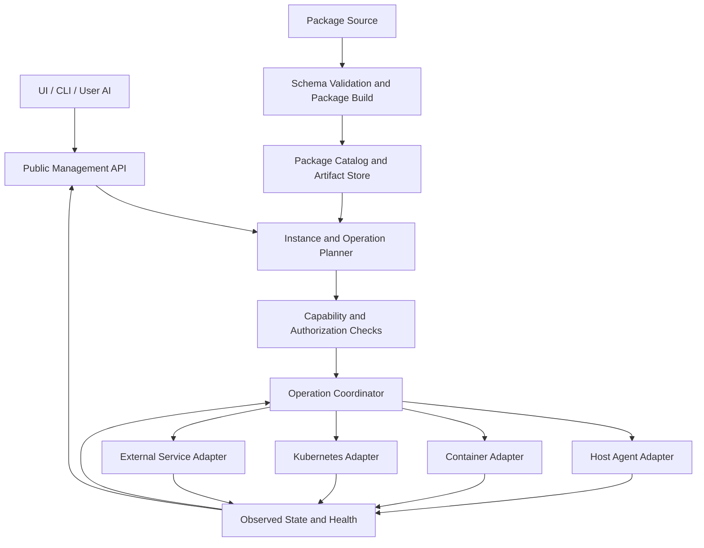

<!---
   Licensed to the Apache Software Foundation (ASF) under one or more
   contributor license agreements. See the NOTICE file distributed with
   this work for additional information regarding copyright ownership.
   The ASF licenses this file to You under the Apache License, Version 2.0
   (the "License"); you may not use this file except in compliance with
   the License. You may obtain a copy of the License at

       http://www.apache.org/licenses/LICENSE-2.0

   Unless required by applicable law or agreed to in writing, software
   distributed under the License is distributed on an "AS IS" BASIS,
   WITHOUT WARRANTIES OR CONDITIONS OF ANY KIND, either express or implied.
   See the License for the specific language governing permissions and
   limitations under the License.
--->

# Mpack Architecture: Extensible Software Management

Status: target architecture for the authorized remote implementation. Broad
scope, declarative authoring and multi-cluster compatibility are confirmed
directions. Detailed contracts use the conservative execution defaults in
[execution-runbook.md](execution-runbook.md); they are not claims of already
implemented APIs. Working interface details can be refined compatibly with
evidence while confirmed constraints remain binding.

The authoritative decision status is in
[architecture-decisions.md](architecture-decisions.md). The prior
[integration plan](integration-plan.md) defines the active integration,
publication and subsequent improvement sequence.

Required compatibility baseline: the generic multi-cluster reference at
`8bf556b6ce94b350b3c3b12e15a7882d07bd19f7` is assessed in
[multi-cluster-alignment.md](multi-cluster-alignment.md). Its generic platform
scope must be distinguished from its first concrete managed-dependency software
integrations. The user requires mpack to remain compatible with that design.
Its Cluster ownership, current service identity, authorization, routes and
workflow/dependency protocols are constraints on this architecture. Mpack must
not independently replace those contracts.

### Mandatory Multi-Cluster Compatibility

- Cluster remains the ownership and authorization anchor for existing managed
  deployments; an Ambari Host/Agent belongs to at most one runtime Cluster.
- Existing service identity remains `(cluster_id, service_name)`. New package,
  plan or operation IDs do not replace that runtime identity or its foreign keys.
- Preserve cluster-scoped REST routes, explicit UI context, numeric metric
  identity, server-authorized events and owned/revisioned workflow recovery.
- Use the shared dependency protocol. Preserve binding UUIDs, snapshots,
  provider ownership, lifecycle guards and execution-fencing guarantees.
- Environment is not a new authority or Host ownership root. Runtime targets
  describe where an authorized service executes within the existing scope.
- Changes to shared service identity, dependency schemas or lifecycle contracts
  require a separately agreed compatible evolution of the multi-cluster platform.
  They are not implicit mpack implementation tasks.

These constraints supersede earlier alternative proposals and historical
integration instructions wherever they conflict. See the compatibility acceptance matrix
in [multi-cluster-alignment.md](multi-cluster-alignment.md).

## 1. Product Definition and Success Criteria

An mpack is a versioned software-management extension package. It describes
software components, supported deployment forms, configuration, dependencies,
operations, health and presentation. Ambari interprets that description through
stable management contracts and runtime adapters.

The target coverage includes host software, containers, Kubernetes workloads,
and externally deployed software or managed services. Coverage is expressed as
explicit capabilities per runtime profile. Supporting a software type does not
imply that every operation is available on every installation.

Examples of intended outcomes:

- Add an HTTP service on Linux by declaring its artifact, user, directories,
  configuration template, systemd unit and health endpoint.
- Deploy a database independently in separate Clusters, with isolated data,
  ports and configuration. Same-type independent service deployments inside one
  Cluster require a separate platform capability and are outside this baseline.
- Deploy the same application's OCI image or Helm release using a different
  runtime profile while retaining its software identity and management view.
- Register an existing database for health, metrics and approved maintenance
  operations without installing or taking ownership of its infrastructure.
- Compose several software instances with versioned dependency contracts and
  explicit endpoint/configuration bindings.
- Let an AI discover schemas, generate a package, validate it locally, run
  lifecycle tests and submit a reviewable deployment plan through public APIs.

Measurable design acceptance:

1. Adding a typical service requires no Ambari server or frontend source edit.
2. A package can be validated and tested before a production server installs it.
3. Identical instance names in different scopes never select the wrong target.
4. The API explains unsupported capabilities and invalid configurations before
   executing an operation.
5. A failed or interrupted operation exposes its actual state and a supported
   retry/recovery path.
6. The same validated model drives UI, CLI, automation and AI tools.
7. Adding a runtime adapter does not require redesigning package identity or
   lifecycle state for all existing software.

## 2. Architecture Boundaries

Ambari coordinates software-management intent, policy, configuration,
observations and operations. Existing platform managers continue to own their
native resources: systemd owns host units, a container runtime owns containers,
and Kubernetes controllers own their workloads.

Ambari must not compete with a Kubernetes controller by directly restarting
its Pods, or install host packages inside an arbitrary container as a fallback.
Runtime profiles select a supported implementation explicitly.

Initial implementation should use logical modules within the existing Ambari
server and Agent. A new microservice fleet, a replacement Kubernetes scheduler,
or a general-purpose configuration language is not required by this design.

The extension surface separates three concerns:

| Concern | Owner | Example |
| --- | --- | --- |
| Software knowledge | Mpack author | Configure PostgreSQL and verify readiness |
| Platform mechanism | Runtime/distribution adapter | Manage a systemd unit or Helm release |
| Coordination and policy | Ambari core | Bind dependencies, authorize, plan, dispatch and track results |

Package code can implement software-specific behavior through the SDK. A pack
cannot silently replace a trusted control-plane runtime adapter by shipping a
class with the same name.

## 3. Lessons from Community V2

Reference implementation: Apache Ambari
`branch-feature-AMBARI-14714` at
`05ffef5b6640a4adcc7af7fff1bec774539a55ae`.

| Existing concept or behavior | Retain | Proposed change |
| --- | --- | --- |
| Mpack, modules and component metadata | Versioned distribution of service-management knowledge | Introduce an explicit validated authoring contract and artifact identities |
| Package mapped to Stack name/version | Legacy compatibility with Stack parsing | Make Stack an optional composition/compatibility view, not package identity |
| ServiceGroup and service instances | Explicit addressing and grouping intent | Project onto existing cluster/service identity; do not import a competing primary-key model |
| RegistryAdvisor | Package discovery, compatibility and upgrade recommendations | Separate recommendation from deterministic dependency resolution and locking |
| MpackAdvisor | Placement and configuration expertise | Expose typed inputs/results with instance-qualified diagnostics |
| Blueprint instances | Declarative composition and repeatable provisioning | Share the same instance/dependency model with interactive deployment |
| Instance manager | Component directories and version selection | Use runtime adapters, configured roots and explicit ownership |
| Script lifecycle | Escape hatch for complex software | Standardize context, result, idempotency and recovery contracts |
| Upgrade machinery | Task orchestration, progress and version tracking | Separate artifact availability, instance selection and data migration semantics |

Specific source observations motivating this proposal:

- `MpackManager.createSymLinks` couples package name/version to Stack paths.
- `ClusterImpl` has an ID map and a service-name map at the same time; a
  name-only compatibility lookup can lose group identity.
- Package registration combines download, extraction, publication, metadata
  loading and database changes without a clear operation boundary.
- Registry compatibility, service dependencies and placement dependencies are
  different mechanisms and should not be represented as one undifferentiated
  dependency list.
- `mpack-instance-manager` assumes a particular host filesystem layout; that
  cannot describe an external service or Kubernetes release.

These are architectural findings from source inspection, not results from a
deployed system test.

## 4. Logical Architecture



Logical server responsibilities:

1. Catalog: package identity, versions, content integrity, schemas and metadata.
2. Deployment integration: desired state and runtime bindings associated with
   existing cluster/service identity and ownership.
3. Resolver/planner: compatibility, dependency bindings, changes and ordering.
4. Operation coordinator: durable task execution, cancellation and recovery.
5. Observation service: health, drift, inventory and provider-reported state.
6. Presentation service: metadata-driven forms, operations and dashboards.

Use existing Ambari request/stage/task and authorization facilities where they
can satisfy these contracts. Do not maintain two competing operation histories
for the same action.

## 5. Domain Model

### 5.1 Definitions, Instances and Execution

| Entity | Responsibility | Identity/lifetime |
| --- | --- | --- |
| PackageVersion | Immutable management definition and artifact references | Package name, release version and verified content digest |
| ComponentDefinition | Component role, configuration, outputs and capabilities | Stable component key inside a package |
| RuntimeProfile | Supported adapter/distribution combination for a component | Profile key and versioned adapter contract |
| ClusterScope | Existing ownership and authorization context | Existing numeric cluster ID and resource authority |
| PackageDeployment | Package release associated with existing service deployments | Additive package-deployment ID; not a replacement service primary key |
| ServiceDeployment | Managed software state within the existing service model | Existing `(cluster_id, service_name)` reference |
| ComponentDeployment | Component/host or adapter-native workload of a service | Existing service/component/host identity; native replica IDs stay within the adapter |
| TargetBinding | Host, container engine, Kubernetes namespace or external resource | Adapter-owned resource identity plus Ambari binding ID |
| DependencyBinding | Connection from a requirement to a specific provider instance | Consumer/provider IDs and contract version |
| OperationPlan | Validated changes against specific desired/observed revisions | Immutable plan ID and hash |
| Operation | Durable execution of one accepted plan | Operation ID and idempotency key |
| Observation | Timestamped facts, conditions, outputs and health | Instance/target identity and observed generation |
| OwnedResource | Files, units, releases or other resources controlled by the instance | Adapter resource key, owner and deletion policy |

The term instance elsewhere in this document denotes a deployment or an
adapter-native resource. It does not authorize a new Ambari service identity.
PackageDeployment groups definition/version information and references the
existing services; all service actions resolve and authorize those references.

Runtime targets select a supported mechanism such as a host, container engine,
Kubernetes namespace or external endpoint. They inherit an explicit existing
management scope. External resources must not gain implicit global authority.
Environment, if retained as UI organization metadata, cannot override scope,
grant permissions or assign hosts. A new kind of non-cluster-owned management
scope requires a separate platform design and compatibility review.

### 5.2 Separate Version Axes

Keep these version axes distinct:

- Authoring/API schema version.
- Mpack release version.
- Software/component binary version.
- Runtime-adapter/SDK contract version.
- Instance configuration generation.
- Application data/schema version when the software manages persistent data.

The Ambari server's JDK requirement is different from the managed service's
JDK requirement. A package must be able to declare them separately.

Published package content is immutable. A different digest under an existing
package name/version is a conflict, not an implicit update.

### 5.3 Software Role and Deployment Form

Software role and runtime are independent dimensions.

| Software role | Examples | Relevant lifecycle |
| --- | --- | --- |
| Long-running service | HTTP server, database, broker | Start, stop, health, upgrade |
| Job | Import, migration, backup task | Submit, observe, cancel, inspect result |
| Client/tool | CLI, connector, SDK | Install, configure, validate, remove |
| Shared library/runtime | JDK, shared client libraries | Provision version, bind consumers, retire safely |
| External service | Managed database, existing endpoint | Connect, observe, and declared remote operations |

Profiles cover host packages/archives, OCI containers, Kubernetes resources or
Helm/operator interfaces, and external APIs. Only tested combinations are
advertised. A package does not automatically support every cross-product of
role, platform, operating system and architecture.

## 6. Package Authoring and Distribution

### 6.1 Authoring Contract

Use one canonical model. Human-friendly YAML and JSON are interchangeable
serializations of that model, not separate configuration languages.

The model describes:

- Metadata, schema version, supported Ambari/Agent/SDK versions.
- Components, roles, placement constraints and runtime profiles.
- Artifact sources and platform compatibility.
- Configuration schema, templates and change effects.
- Dependency requirements and provided interfaces.
- Lifecycle capabilities, health checks and custom operations.
- Observability and presentation metadata.
- Resource ownership, data-retention and recovery behavior.

Structural validation uses JSON Schema or an equivalent explicit machine-readable
schema. Semantic validation checks references, compatibility, ordering,
capability completeness and cross-file consistency. Unknown fields should
normally produce diagnostics rather than being silently ignored.

Common behavior is declared with existing resource primitives such as package,
archive, user, directory, template, process/service, endpoint and health check.
Complex software uses Python through a versioned SDK. Avoid introducing a new
general-purpose expression language before demonstrated requirements justify it.

### 6.2 Proposed Source Layout

```text
my-software/
  mpack.yaml
  components/
    server.yaml
  schemas/
    server-config.schema.json
  templates/
    server.conf.j2
  scripts/
    server.py
  dashboards/
    overview.json
  tests/
    test_lifecycle.py
    fixtures/
  README.md
```

Simple packages may keep all component declarations in `mpack.yaml`; splitting
files is optional. Scripts, dashboards and templates are optional capabilities,
not mandatory empty folders generated for every package.

Exact filenames and schema field names remain a proposal until agreed.

### 6.3 Built Artifact and Locking

The build produces normalized metadata, resolved dependency/artifact references,
content digests, provenance and a file inventory. Version ranges belong to
authoring inputs; a published deployment plan consumes resolved identities.

Separate the management definition from large software payloads. A package may
reference platform repositories, archives, OCI images or Helm artifacts. An
offline export includes all required resolved artifacts and registry metadata.

Registry/catalog responsibilities include versions, search, compatibility
metadata, digests, provenance, trust policy and deprecation. They do not mutate
software instances when a new package version becomes available.

Import, validate, register, deploy, upgrade and unregister are distinct actions.
Registering a package makes it available; it does not install software on hosts.

## 7. Capabilities and Runtime Adapters

### 7.1 Capability Model

Effective capabilities are the compatible intersection of package declaration,
selected runtime profile, adapter support, target environment and policy.

Examples include:

- Install/remove software.
- Start/stop/reload a service.
- Configure and validate configuration.
- Observe inventory and health.
- Collect metrics or retrieve logs.
- Scale, upgrade, backup, restore or execute a declared custom operation.

Each capability defines typed inputs, preconditions, result shape, asynchronous
behavior, side effects, verification and recovery semantics. Capability absence
is a valid state. UI actions and API validation use the same capability model.

### 7.2 Adapter Responsibilities

| Adapter family | Resources it controls | Boundary |
| --- | --- | --- |
| Host | Declared packages/files/users/units/processes | Act through Agent identity and owned resources |
| Container | Images, containers, networks and volumes | Respect engine APIs and persistent-volume ownership |
| Kubernetes | Namespace-scoped release/resource/controller objects | Let Kubernetes manage child workload convergence |
| External | Explicit remote API resources or observed endpoints | Control only declared operations granted by credentials/policy |

Conceptual adapter methods:

```text
describeCapabilities(context)
validate(spec, context)
observe(binding, context)
plan(spec, observation, context)
apply(step, operationContext)
verify(step, operationContext)
cancel(operationContext)
recover(operationContext)
```

These are proposed contracts, not a fixed language interface. Observation and
planning must not change managed software. Apply results identify the resources
actually changed, output references, task state and available recovery action.

Python extensions receive a typed context containing cluster/service and native
resource references, configuration,
dependency bindings, resolved artifacts, directory handles and operation IDs.
They must not depend on global mutable `params` state shared across instances.
Credentials are resolved through explicit secret references and scoped access.

Host profiles may use systemd, supported platform service managers or a custom
driver. Cross-platform support is advertised per adapter, not inferred from the
fact that an Agent starts on an operating system.

## 8. Desired State, Observation and Operations

### 8.1 State Model

Separate desired intent, observed condition, and execution state.

- Desired intent: selected version, configuration generation, placement,
  ownership, presence, and running/stopped state where applicable.
- Observation: resource existence, actual version, health, drift, readiness,
  last successful probe and observation freshness.
- Operation state: pending, running, verifying, succeeded, failed,
  cancellation requested or cancelled.

A submitted start command is not evidence that a service is running. A
successful package install is not evidence that its health check passed.
Stale or unreachable observations remain unknown; they do not imply stopped.

Jobs can reach completion and retain their result without being reconciled back
to a running state. Libraries and external endpoints need no artificial process
start/stop lifecycle.

### 8.2 Plan and Apply

```text
desired specification
  -> validate schema and capabilities
  -> resolve artifacts and dependency bindings
  -> observe current resources
  -> compute changes, prerequisites and ordered steps
  -> evaluate authorization and policy
  -> persist and execute the plan
  -> verify effects and record observations
```

A plan contains specific package digests, target bindings, configuration and
dependency generations, change summary, ordered steps and expected effects.
It references secrets without embedding their values.

Apply checks the revisions used by the plan. Material changes in configuration,
bindings or relevant resources require replanning; a stale plan must not apply
silently to different targets. Health and transient preconditions are checked
again when the relevant step executes.

Use idempotency keys for API retries and persist step identities/results. Replay
uses observation to verify completion; a saved success flag alone cannot prove
an external side effect still exists.

### 8.3 Recovery and Concurrency

Use durable operations, scoped resource locks/leases, bounded retries and explicit
recovery states. A server restart resumes or reconciles persisted operations.
A lost remote result is an unknown outcome until observed, not an automatic
failure that permits repeating a non-idempotent action.

Serialize conflicting operations on the same resource. Allow independent
instances/targets to run concurrently within configured limits. Global host
package changes may require a host/distribution lock even when instance IDs differ.

Cancellation is cooperative. Report cancelled only when execution has stopped
or its outcome has been reconciled. Compensation is defined per step; arbitrary
application data migrations cannot be promised a universal rollback.

Automatic convergence is policy-controlled. Recommended initial default:
observe and report drift, with bounded automatic recovery for explicitly
supported transient failures. Unattended upgrades or destructive changes require
an explicit automation policy, not the mere existence of a reconciler.

## 9. Ownership, Adoption and Removal

Distinguish observing an existing resource from owning it.

- Observed binding: Ambari reads inventory/health and performs only declared
  operations explicitly enabled for that external resource.
- Managed binding: Ambari owns declared resources and can reconcile their spec.
- Adoption: an explicit transition that records identity, current configuration,
  ownership boundaries and a proposed initial managed state.

Owned-resource records define exact ownership and deletion behavior. Shared
resources retain consumer references. Removing one instance must not remove a
runtime, package or volume still needed by another instance.

Separate stopping observation, unregistering a definition, uninstalling software,
and deleting persistent data. Persistent/external data defaults to retention in
this proposal. Data deletion is a separately declared operation with an explicit
target and applicable policy.

An adapter controls its top-level resources and observes subordinate resources.
For example, Ambari manages a Helm release or operator custom resource while
the platform owns its generated Pods.

## 10. Configuration and Secret Management

Proposed configuration hierarchy:

```text
package defaults -> environment policy/defaults -> software instance
                 -> component instance -> explicitly supported target override
```

Every effective value has a source and change impact. Configuration schema
declares type, constraints, sensitivity, mutability, restart/reload behavior and
whether it is generated from another binding.

Define merge semantics. Maps merge only where the schema permits; lists replace
by default unless a key-based merge is declared. Avoid implicit concatenation
or last-write-wins behavior for dependency outputs.

Validate the effective configuration before applying it. Render into staged
locations and publish through the adapter's supported atomic mechanism. Track
configuration generations, desired/applied revision, history and rollback
availability. State whether rollback also needs a restart or is incompatible
with the selected software version.

Secrets are typed references to existing Ambari credential facilities or
supported external secret providers. Resolve values only in the required
execution context. Secret version changes can trigger a controlled reconcile;
plans, package archives, diagnostics and logs never contain plaintext values.

External edits are drift observations. Whether to preserve, import, or replace
them is a declared ownership/policy decision.

## 11. Dependency and Composition Model

Use distinct dependency classes:

| Class | Example | Resolution |
| --- | --- | --- |
| Package/artifact | Driver needs a compatible client library | Version constraints, platform constraints and lockfile |
| Runtime interface | Application needs PostgreSQL or a Kafka endpoint | Bind to a specific instance providing a versioned interface |
| Placement | Worker needs a local client or a distinct failure domain | Target constraints and supported placement validation |
| Operation ordering | Configure after endpoint exists; start after readiness | Directed operation prerequisites and health conditions |

Bindings use stable IDs and typed interfaces, not display-name matching or
unstructured string substitution. A provided interface can expose endpoint,
protocol version, TLS requirements and secret references.

Detect missing providers, incompatible versions, ambiguous candidates and
unsatisfiable placement before mutation. Reject cycles in required operation
ordering. A relationship graph may contain a cycle only if the declared
bootstrap/operation graph can still execute safely.

Support explicit composition of package instances while allowing each package
to evolve independently. A composition locks the selected versions and records
configuration/output bindings. It does not turn a collection into a new global
Stack that all existing instances must adopt.

Avoid competing schedulers: host placement can use Ambari's topology facilities;
Kubernetes placement is passed to the platform as validated constraints.

## 12. Upgrades and Stateful Software

An upgrade plan distinguishes:

1. Downloading/registering new management definitions and software artifacts.
2. Checking compatibility of adapters, dependencies, configuration and data.
3. Preparing targets and, where supported, backups or snapshots.
4. Updating component instances according to the declared strategy.
5. Verifying health and dependency contracts before progressing.
6. Finalizing versions or entering a documented recovery state.

Strategies may include restart replacement, rolling batches, canary, or
blue/green deployment when the software and runtime support them. They are
capabilities, not a mandatory promise for every package.

For stateful systems, explicitly declare data migrations, compatibility windows,
backup/restore requirements and downgrade limits. A filesystem version link can
be reversible while the application data format is not.

Scaling, backup/restore, credential rotation and maintenance tasks use the same
operation and policy contracts rather than side channels with no task history.

## 13. Health, Observability and User Interface

Separate installed, running, ready and healthy conditions. Health checks can
combine process, port, HTTP, command, platform status and application checks,
with freshness, timeout and aggregation rules.

Expose metrics, logs, events, alerts and dashboards through package metadata and
existing Ambari facilities. For metrics, reuse supported monitoring integrations
instead of shipping a monitoring stack in every package. Instance and component
identity must be stable in observations; avoid unbounded label cardinality.

Generic UI surfaces:

- Catalog and compatibility view.
- Deployment/configuration forms generated from schema and UI hints.
- Plan/change preview with target and dependency bindings.
- Instance topology, version, health and configuration history.
- Available operations and their typed parameter forms.
- Task progress, diagnostics and recovery actions.
- Logs/metrics/dashboard links scoped to the selected instance.

Most new software should require metadata, not new React pages. Custom
presentation uses a separate versioned extension contract. Package-provided
HTML/JavaScript must not execute implicitly in the main UI.

## 14. API, CLI and AI Development Experience

The API is the authoritative contract. CLI and UI call it; AI has no privileged
side channel. Publish machine-readable schemas, capabilities, constraints,
diagnostics, operation states and supported recovery actions.

Proposed author/deployment workflow:

```text
init -> validate -> test -> build -> publish/import
     -> register -> plan -> apply -> observe
```

Commands are a design target, not an implemented CLI.

| Tool capability | Required behavior |
| --- | --- |
| init | Minimal template for chosen role/runtime with working test scaffolding |
| validate | Offline structural/semantic checks; JSON diagnostics and meaningful exit codes |
| test | Isolated lifecycle, configuration, retry and adapter contract tests |
| build | Deterministic normalized definition, lockfile and content inventory |
| publish/import | Registry or offline bundle workflow with digest verification |
| plan | Explain effects and prerequisites against a specific environment |
| apply | Execute a specific plan with idempotency and typed operation status |
| observe | Retrieve actual state, health, drift and failure/recovery context |

Diagnostics include a stable code, severity, file/field path, affected instance,
message and remediation guidance. Never require an AI to scrape human log text
to determine whether an operation succeeded.

Offer schemas, reference packages, SDK documentation and a local test harness
as the primary AI integration. An optional skill or MCP facade can expose the
same API later; it must not duplicate validation rules or bypass permissions.

The repair loop is: discover contract, generate/edit source, validate, run tests,
inspect structured failures, correct, then create a deployment plan. Generated
packages must pass the same checks as manually authored packages.

## 15. Authorization and Extension Trust

Authorize catalog administration, instance changes, custom operations, provider
installation and secret access separately using existing authorization concepts.
Resource scope resolves to the existing authoritative Cluster/service context,
not a package name or caller-declared Environment supplied by a client.

Package scripts are executable code. Define where they run, their execution
identity, resource/network access and timeout. Process isolation alone is not
a security sandbox. Enforceable execution controls and adapter conformance are
part of the platform contract, with legacy compatibility limits stated plainly.

Verify artifact digests and apply repository/signature trust policy where
configured. Audit package identity, plan, actor, target and result without
recording secret values. User automation follows configured policy; the
architecture does not require a human prompt for every routine operation.

## 16. Scale and Operational Resilience

Use incremental observation, bounded polling, platform watches where available,
and exponential backoff. Report observation freshness and target connectivity.
Do not poll every instance at the same rate regardless of cost or state.

Persist operation progress and use database-supported ownership/leases for
coordinators. Keep distributed locking scoped to actual shared resources.
High availability can build on those durable semantics without changing the
public lifecycle contract.

Limit concurrent package downloads, extractions, script executions and target
mutations. Cache immutable artifacts by digest. Define retention for operation
logs, observations and old artifact versions with reference-aware cleanup.

## 17. Compatibility Strategy

Import legacy V1/V2 definitions through a compatibility translator into the
canonical model where mappings are lossless. Where translation is not possible,
use an explicitly limited legacy execution profile and report its capabilities.

Preserve existing lifecycle scripts while introducing the typed context through
adapters. New definitions use the authoritative cluster/service reference and
binding incarnation; compatibility lookups must reject ambiguity rather than
silently choosing a deployment.

Keep existing Stack/Blueprint APIs as compatibility views where practical.
New generic software packages do not require a synthetic Stack for identity.
Configuration and upgrade history remain associated with the original service
identity. Mpack does not independently migrate `clusterservices` primary keys,
dependency endpoint foreign keys or the service-group identity model.

Specify separate compatibility matrices for manifest schema, Agent/SDK,
runtime adapters, managed software and Ambari API clients. Publish a deprecation
and migration path before removing an older contract.

## 18. Validation Architecture

Validation has separate layers and explicit limits:

1. Offline schema validation: structure, types, required fields and references.
2. Semantic validation: dependency/capability/configuration consistency.
3. Package/SDK tests: software behavior in isolated resources and failure cases.
4. Adapter conformance: observation, idempotency, ownership, cancellation and
   recovery behavior for a runtime family.
5. Deployment planning: real target capabilities, conflicts and permissions in
   the owning Cluster scope.
6. End-to-end acceptance: actual deployment, reconfiguration, restart, upgrade,
   failure/retry, adoption and removal on representative platforms.

A successful static validation cannot prove service readiness or data migration
safety. Test results and capability maturity must say what was actually exercised.

Reference packages should cover a stateless HTTP service, a stateful database,
a distributed service with dependencies, a Kubernetes application and an
observed external service. These are acceptance targets, not fixed product
choices or completed implementations.

## 19. Proposed Delivery Order After Design Agreement

All four deployment families are in the target scope. Delivery stages establish
working contracts with reference software before multiplying integrations.

| Stage | Main result | Exit evidence |
| --- | --- | --- |
| Architecture agreement | Domain model, extension boundaries and lifecycle contracts | Recorded decisions and worked examples |
| Common contract | Schema, identity, capability and operation model | Contract tests and compatibility mapping |
| Host reference | Host package/archive service plus existing-service adoption | Separate-cluster deployments, config, health, retry and removal tests |
| Container reference | OCI deployment using the same software/instance model | Persistent resources and lifecycle conformance |
| Kubernetes reference | Platform-backed application profile | Reconcile boundaries, namespace identity and failure recovery |
| External reference | Observe and supported remote operations | Ownership and credential-scope conformance |
| Stateful and composition depth | Dependencies, scaling, upgrade and backup/restore | Explicit data compatibility/recovery evidence |
| Author ecosystem | CLI/SDK/catalog/templates and AI documentation | Independent author builds and manages software without core changes |

The user has authorized remote Sol xhigh execution of the plan. Delivery follows
the integration/publication/improvement order, using conservative defaults and
the shared-contract review boundaries in the execution runbook.

## 20. Execution Defaults and Further Refinement

The execution runbook supplies conservative defaults for routine design choices.
Refine these areas with concrete source/runtime evidence and parent review:

- Versioned extension points for runtime targets and software capabilities
  within the existing multi-cluster scope and identity contracts.
- Default reconciliation policy: observe-only drift versus bounded automatic
  recovery for supported service failures.
- Compatibility commitment: lossless translation plus a limited legacy profile,
  and the intended deprecation policy for old definitions.
- Initial Kubernetes ownership level: Helm/manifests first, or operator-specific
  resource contracts as a first-class authoring surface immediately.
- Custom UI extension policy: metadata-generated UI first, with a separately
  controlled plugin surface for exceptional software.
- Concrete reference software and the environments available for acceptance.

Performance targets, supported OS/version matrix, schema field names and the
exact SDK/API signatures should be finalized with those worked examples.
