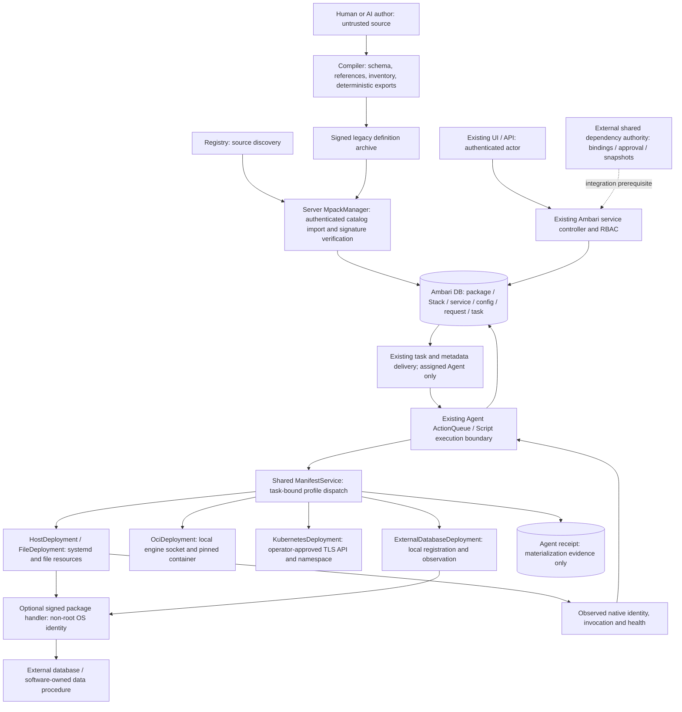

<!---
   Licensed to the Apache Software Foundation (ASF) under one or more
   contributor license agreements. See the NOTICE file distributed with
   this work for additional information regarding copyright ownership.
   The ASF licenses this file to You under the Apache License, Version 2.0
   (the "License"); you may not use this file except in compliance with
   the License. You may obtain a copy of the License at

       http://www.apache.org/licenses/LICENSE-2.0

   Unless required by applicable law or agreed to in writing, software
   distributed under the License is distributed on an "AS IS" BASIS,
   WITHOUT WARRANTIES OR CONDITIONS OF ANY KIND, either express or implied.
   See the License for the specific language governing permissions and
   limitations under the License.
--->

# Mpack architecture

## Independent conclusion and support boundary

The design can support a bounded family of software through existing Ambari
services, configuration and tasks. It does not yet constitute a general production
platform for every runtime. The reviewed R1 unsafe dispatcher and disconnected UI
were prototypes; the repair adds an actual compiler-to-legacy-import-to-shared-Script
host path. Native production acceptance remains separate from local code completion.
See [status](status.md) for implementation and verification evidence, and the
[independent report](reviews/independent-architecture-review-2026-09-10.md) for the
original line-specific findings and Redis/Kyuubi walkthroughs.

Architecture is reasonable where it reuses Ambari authority and isolates native
execution. Maintainability improves by having one compiler and one host Script,
without package-specific Java/Python dispatch. Extensibility is currently strongest
for foreground host services with scalar configuration. Stability requires bounded
commands, durable task identity, observed postconditions and conservative UNKNOWN
handling; these mechanisms are implemented but require native acceptance. Complexity
is limited by removing unused simulators/facades instead of operating a second
workflow, binding store or authorization system.

Current executable contracts share the `host-service/v1` delivery descriptor and
`ManifestService`, with a distinct adapter per profile. `host.systemd/v1` manages
foreground services, typed multi-file configuration, scoped secret references,
health and declared lifecycle operations. `host.files/v1` publishes CLIENT files.
`oci.container/v1` manages local rootful Docker/Podman containers with preloaded pinned
images. `kubernetes.workload/v1` manages stateless Deployments in an operator-approved
namespace. `external.database/v1` registers and observes a remote native identity;
its uninstall unregisters local evidence and never deletes the database. The current
capability/evidence matrix in status is authoritative about the limits of each profile.
Software backup/migration/restore uses an optional signed package handler on an already
verified stopped systemd target; it is not automatic configuration migration or data
rollback. Arbitrary foreign adoption, orphan purge, rolling upgrade and distributed
transactions remain outside the supported contract.

A cluster still has its existing Stack/service model. Multiple independent services
of the same type inside one cluster cannot be invented through aliases. Multiple
clusters can use the same package; native units include the existing cluster,
service, component and server-allocated service-row incarnation. Hosts retain their
existing Agent membership. Same-host ports/users/OS packages are shared host resources:
there is no private OS package namespace or port allocator. Manifest authors must
choose compatible packages and distinct ports; a bind/start failure remains a failed
or unknown operation requiring observation, never proof of success.

## Responsibilities, stores and trust boundaries

The compiler performs no runtime calls or authorization. The server owns package
trust, existing permissions and task scheduling; it does not generate arbitrary
native argv from request parameters. The Agent interprets an installed authenticated
definition and protects its local target; it does not authorize users or decide
cross-cluster ownership. Adapters must return runtime-specific evidence and may
reject unsupported capabilities. UI and AI consume the same contracts and cannot
supply approval, fencing or execution trust markers.

| State | Authority / persistence | Writer and readers | Concurrency and lifecycle |
| --- | --- | --- | --- |
| Cluster/service/RBAC/host membership | Existing Ambari DB | Existing controllers; Agent receives scoped projection | Existing PK/FK and authorization; no replacement identities |
| Package release | `mpacks`, `content_digest`; immutable definition files | MpackManager/DAO; metadata/task generation reads | Catalog lock plus DB constraints; registration marker reconciles crashes |
| Service package selection | Existing desired repository/Stack relationship | Existing service controller; topology metadata | Existing service repository pins a package; conflict validation and row locks; Blueprint selections stay constrained to the actual Stack |
| Native binding incarnation | `clusterservices.mpack_target_incarnation` | ClusterServiceDAO; task/service metadata reads | Row lock and conditional initialization; new service row gets a new incarnation |
| Desired configuration | Existing Ambari configurations and tags | Existing configuration API; tasks/Agent consume | Existing versioned publication; typed host validation before local staging |
| Operation intent/result | Existing request/stage/task and command persistence | Existing scheduler; Agent reports | Existing task IDs; no second operation DB or autonomous recovery loop |
| Applied configuration/native evidence | Root-owned Agent deployment `receipt.json`, config generations | Shared host Script; subsequent tasks/status read | Atomic fsync/rename, local flock, task ordering and expected receipt hash |
| Retained target and confirmed release | `mpack_target_resource` in existing Ambari DB | Task intent writer and authenticated Agent report projection; catalog/UI read | Latest-task match, native postconditions, separate selected/latest-intent/materialized package references; survives service removal |
| Native resource state | systemd invocation, file publication, OCI engine/container, Kubernetes namespace/Deployment UID, external provider identity | Native runtime/provider; Agent observes | Runtime-specific preconditions and observations; exit code and resource name alone are insufficient |
| Dependency binding | External shared platform | Shared coordinator; future Mpack client consumes | Platform UUID/incarnation/snapshot/revision/authorization/fence; no fabricated readiness |
| Catalog staging/quarantine | Filesystem projection, not authority | MpackManager startup/registration/removal | DB decides availability; quarantine retained for operator inspection |

The service incarnation is native-target metadata, not a service ID. It prevents a
recreated name from silently inheriting old units/data. One local receipt per bound
component is necessary to distinguish previous invocation/configuration from desired
state after a lost response; it contains no permission decisions or competing task
history. Losing this receipt requires explicit investigation rather than adoption
by name. Server DB loss requires existing Ambari database recovery.

## Reliability and failure ownership

Registration prepares outside the publication lock, authenticates content, writes a
pending marker, publishes definitions/Stack link and persists catalog/Stack rows.
Startup completes a DB-backed publication or quarantines an uncommitted one. If DB
rollback fails, definitions remain available for reconciliation. Removal commits
catalog/repository/Stack deletion in one DB transaction before moving definitions
out of availability. Reference writers (Blueprint, cluster, repository and Stack DAOs) take the existing
package-row lock in the same transaction as the reference write, serializing with
catalog deletion. Foreign keys remain the final integrity guard. H2 concurrency
tests demonstrated that foreign keys alone were insufficient for uncommitted
reference creation. Historical Blueprint JSON references are checked, and new
settings cannot escape their Stack. Deleted Stack/repository JPA projections are
detached/evicted so a committed removal does not remain visible through cached IDs.
Filesystem cleanup failure after DB commit is retried at startup. Quarantine is
operator-retained catalog evidence, never native application data. Multi-server
filesystem HA is outside this milestone; a message bus or distributed transaction
manager would not repair the existing filesystem ownership boundary.

ActionDBAccessorImpl binds service/package/host/action and scoped configuration
snapshots immediately before existing execution_command persistence. Agent metadata
can invalidate that task but cannot retarget it. The native plan is computed on the
Agent using current runtime facts; there is no additional server discovery endpoint.

The host Script requires an existing server execution task for mutation; automatic
Agent-local recovery is disabled for generated components. Plans bind task, package
digest, ServiceRef/incarnation, configuration hash/tags, actual observation, expected
receipt and a 30-second discovery/plan lifetime. The driver serializes one target,
rejects stale tasks/plans and writes APPLYING before effects. Configuration is typed,
rendered into an unpublished generation and atomically switched; running generation
only advances after verified start. Configuration changes restart an active service.
Declared reload requires unchanged invocation and an HTTP configuration-generation acknowledgement. Data migration is a separately authorized explicit package operation; changeEffect=none/migration is rejected.
Explicit RESTART is one task intent,
not inherited STOP+START with the same task ID. STOP is independent of invalid desired
configuration. Status probes the verified running port/config, with desired/published/
running generations kept separate.

A repeated completed task only observes/verifies. A lost start response can be
reconciled from a new native InvocationID and matching intent without another start.
Pending native jobs and interrupted starts without surviving invocation evidence
stay UNKNOWN without a second start. An explicit server STOP can establish a
known inactive state before another START. Compatible stopped artifact upgrades require signed compatibility and unchanged resource/data layout; restoring repository selection is not data rollback. Cancellation is a request to stop work, not proof that native
side effects stopped; native timeout/cancellation remains UNKNOWN and disables
automatic Agent retry. Late old tasks cannot overwrite a newer local receipt.

Listener preflight rejects occupied declared IPv4 TCP/UDP ports before provisioning
or publication. It is an availability check, not a distributed port reservation;
a subsequent race still requires native postcondition verification. HTTP health
never follows redirects away from the declared probe.

Native subprocess stdout is capped at 64 KiB, stderr is drained without persistence,
process groups have deadlines/cancellation, discovery/show/probes are bounded, and
configuration history keeps ten recent plus current/running generations. Existing
Ambari request/task/log retention remains the platform policy. OS package resource
execution retains its existing Ambari timeout semantics. Persistent resource
directories are never pruned automatically. Explicit PURGE requires SERVICE.PURGE_DATA, matching retained inode evidence and native absence, while the service record still exists.

## Minimal abstractions, migration and cost

| Decision | Benefit | Implementation / migration cost | Ongoing cost and simpler alternative |
| --- | --- | --- | --- |
| Keep existing service/Stack/task/config authority | Preserves RBAC, routing and audit | Add package digest and native incarnation metadata; nullable DDL migration | A small same-DB target evidence table and shared Script; a parallel Deployment/Operation database is unnecessary |
| Keep compiler + small profile-specific executor | New Redis/HTTP-like software changes source files only | Strict schema/inventory may reject previously ignored source fields | One schema and scalar runtime projection; copied lifecycle scripts multiply fixes |
| Emit actual legacy modules and authenticate import | Reuses existing registration/Agent resource delivery | Ed25519 publisher trust and explicitly enabled alpha HMAC compatibility; rebuild incompatible alpha bundles | One versioned verifier/importer and operator-managed trust file; source ZIP remains separate from deployable transport |
| Remove parameter dispatcher and simulation execution models | Closes root-command authority hole and duplicate recovery | Queued alpha runtime commands fail; external alpha library consumers must migrate | No command forwarding facades; retain only static capability declarations and ServiceRef |
| Remove unconsumed Java lifecycle/config facades | Blueprint stops pretending to be live state | Old fields ignored when read; new assertions rejected | Existing task/config models suffice until a concrete new consumer exists |
| Keep registry/catalog; transactional deletion + reconciliation | Recoverable file/DB ordering | Existing reference constraints and two pending markers | Bounded publication critical section; operator quarantine retention remains necessary |
| Remove disconnected runtime UI/API client | No nonexistent endpoints or package-scoped execution permission | Existing catalog and real service screens remain | A generic runtime console waits for an implemented service-scoped API |
| Delegate shared binding authority | No fake approvals or duplicate fencing | Real client integration and provider contract extension required | No second binding DB, authorization layer or global retry coordinator |

New software under this host contract adds manifest, config schemas/templates and
vendored artifacts (or declared OS package prerequisites), then uses the same
validation/export/import/service workflow. A new config scalar touches those source
files. A new lifecycle semantic or bottom-level runtime requires a versioned contract,
its own evidence/recovery implementation and focused tests; adding method names to
all runtimes would not establish equivalent behavior. No arbitrary plugin JavaScript, plugin sandbox or workflow DSL is introduced. The
optional package Python handler is the smallest extension needed by two concrete
consumers: software data procedures and external resource probes. It runs authenticated
code under a non-root OS account with bounded JSON I/O, no supplementary groups and
no shell. This is trusted package execution, not a sandbox: administrators must trust
that publisher within the account's filesystem/network privileges. A declaration alone
cannot implement a product migration or identify an external database. Handler evidence
is execution output in the existing receipt, not a second state authority.

## External prerequisites and deferred product scope

The shared reference commit `8bf556b6ce94b350b3c3b12e15a7882d07bd19f7` is read-only and
not integrated here. Its managed dependency type enumeration has HDFS and ZOOKEEPER;
the authoring client boundary delegates to an injected real client and fails when
absent. Cross-cluster approval/config propagation requires a real shared platform,
not a local UUID or mock. The user removed the Kyuubi example and its dedicated
integration work from the current scope on 2026-09-10.

OCI/Kubernetes/external observation implementations and focused fixtures now exist.
Their real native/provider acceptance remains open. Package trust/import, service-scoped
selection, retention/purge, scoped secrets, client files and existing metrics/log
projections have local checks recorded in status. LogSearch collectors, real Redis/systemd,
production DB fresh/upgrade and live server-Agent fault recovery still require appropriate
environments. Static declarations, fixture output and compilation cannot close these gates.

## Package import and lifecycle extension

Status: implemented local alpha; current evidence and native gates are in status.md. The independent third-party Store
has its own [design and future-repository plan](store-design.md). Its website/backend
will be implemented later in a new repository, never in Ambari. Ambari owns only
package import and installed software management. The [delivery plan](implementation-plan.md#package-import-and-lifecycle-delivery-plan)
tracks that work without depending on a running Store.

A user downloads a deployable package or copies its artifact URL from any compatible
source, then imports it into Ambari. Use one bounded, staged importer for both paths.
Verify immutable release identity, content inventory, signature, compatibility and
prerequisites before publication to the local catalog. Public publisher trust requires
asymmetric verification and configured trust; alpha HMAC remains an explicit local
compatibility mode without downgrade. Remote imports restrict destinations/redirects
and credential forwarding; credentials are external references, never package content.
The versioned artifact contract is shared with the Store; publication accounts and
Store discovery APIs are not prerequisites for import or execution.

Import registers a definition without deploying native resources. Installation selects
an imported package for an existing cluster/service. Native uninstall removes owned
resources with default data retention; catalog removal deletes only unreferenced
package definitions. Detach and separately authorized purge remain distinct operations.

Extend MpackManager and the `ManagementPacks` screen for file/URL import and management
of already imported package versions, trust and compatibility. Reuse service configuration
and request/task screens. Existing Registry integration may remain compatible; this
delivery adds no Store browsing, search, publisher/upload portal or embedded third-party
pages to Ambari. External publisher upload is distinct from uploading a downloaded file
to Ambari for import. Actual resource-provider, authorization and test evidence is recorded
in status; the design alone does not prove runtime acceptance.

Independent packages in existing clusters need service-scoped definition resolution.
Start with service/component desired repository relationships and trace metadata,
configuration, scripts, upgrade selection and Agent delivery through one pinned package.
Preserve cluster Stack and ServiceRef identity. Reject conflicting service names,
configuration types, component definitions and shared host prerequisites before creation;
do not invent service aliases. Add a nullable package-selection FK to existing service
state only if a documented use case cannot be represented by the existing relationship.
This integration is required even when the Store website is already usable.

Add provenance/version/signature metadata to existing catalog release state as needed;
preserve its primary key and references. Ambari DB remains authority for imported
packages, service selection, configuration and operations. Store DB owns publication
only; Agent receipts contain native evidence, not permissions or global lifecycle state.

Uninstall persists intent in existing workflows, stops/verifies the workload, deletes
only exact owned units and ephemeral config/artifacts, then verifies absence. Shared OS
packages/users and persistent data are retained. Multi-host partial failure keeps service
identity and per-target recovery results; it cannot appear fully removed. Serialize with
other service mutations and retain evidence for interrupted/UNKNOWN work.

Before deleting service identity, persist retained-resource descriptors containing
ServiceRef/incarnation, host, exact native identities/paths, ownership proof and package
digest. They must survive task-log expiry. Prefer existing durable service audit storage;
if it cascades with service deletion, add a narrowly scoped retained-resource tombstone
table in the same Ambari DB. This is retention evidence, not another deployment/workflow
authority. Keep necessary package/recovery references until retention obligations are
discharged. Missing ownership proof requires investigation, never name-based deletion.

Detach releases management without native deletion; adoption validates identity and
ownership explicitly. Purge targets retained resources with a separately audited
authorization. Reuse existing RBAC, adding a specific authorization only if existing
permissions cannot express the distinction. Consumer uninstall never deletes shared
provider-owned data. Upgrade pins old/new digests, config compatibility, dependency
snapshots and native identity. Code rollback differs from data recovery; irreversible
migrations require declared preconditions and appropriate backup/restore evidence.

Runtime adapters declare unsupported actions and implement native identity, discovery,
postconditions and recovery for each supported action. Secret resolution, dependencies,
metrics/log access and other runtimes remain required roadmap work with separate gates.
The standard publisher path is manifest/schema/templates/artifacts -> validate/build/sign
-> upload/publish -> import -> existing service deployment. New software in an implemented
profile requires no software-name Java/Python branches or copied lifecycle scripts.
AI follows the same validation, signing and human/publisher approval boundaries and cannot
grant itself publishing, migration or deployment authority.
