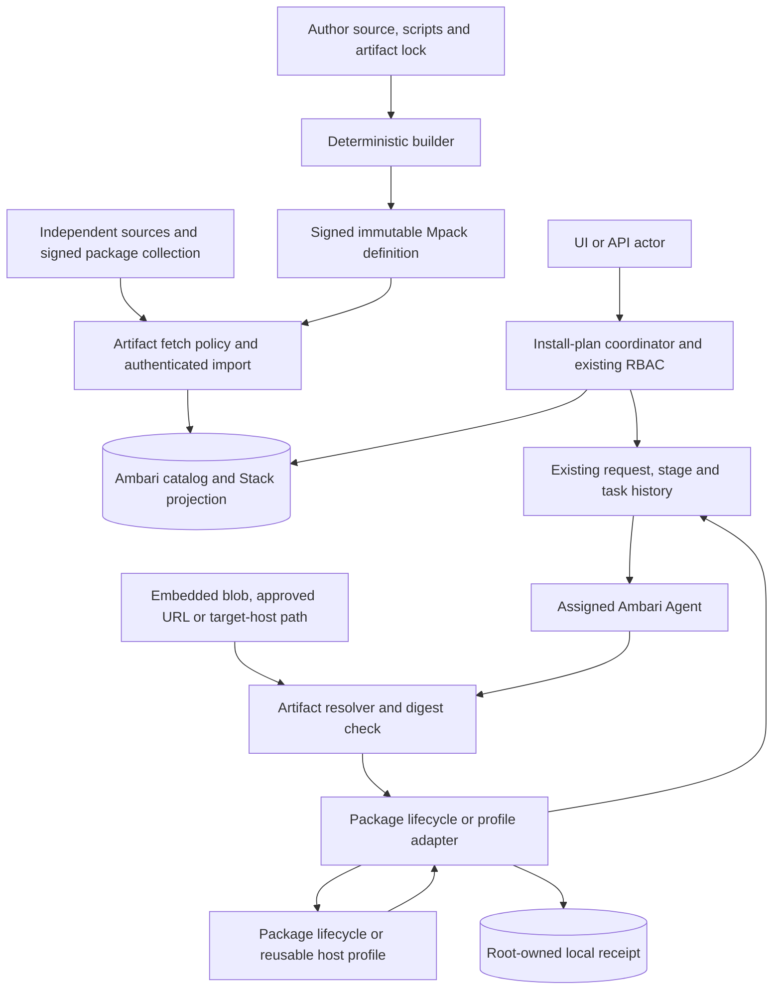

<!---
   Licensed to the Apache Software Foundation (ASF) under one or more
   contributor license agreements. See the NOTICE file distributed with
   this work for additional information regarding copyright ownership.
   The ASF licenses this file to You under the Apache License, Version 2.0
   (the "License"); you may not use this file except in compliance with
   the License. You may obtain a copy of the License at

       http://www.apache.org/licenses/LICENSE-2.0

   Unless required by applicable law or agreed to in writing, software
   distributed under the License is distributed on an "AS IS" BASIS,
   WITHOUT WARRANTIES OR CONDITIONS OF ANY KIND, either express or implied.
   See the License for the specific language governing permissions and
   limitations under the License.
--->

# Mpack V2 architecture

## Product boundary

Mpack V2 extends Ambari with signed, installable software definitions. An Mpack may
ship service definitions, package-owned lifecycle scripts, configuration, health
checks and software payloads. The payload may be embedded or resolved at installation
from an approved URL or target-host local path. This removes the requirement to build
an RPM for every managed product. Ambari remains the only cluster deployment authority:
it owns RBAC, service state, configuration history, requests, tasks, host assignment
and Agent delivery.

Package lifecycle scripts are trusted code executed through Ambari's existing Agent
command-script mechanism. A signature identifies and protects package content; it does
not make that code safe. Publisher trust, package review and install authorization are
therefore security boundaries. Product-specific installation and observation belong in
the package, never in product-name branches in Ambari Server, Agent or UI.

The product is not a new workflow engine, sandbox or distributed transaction platform.
OCI and Kubernetes execution are outside this repository. The current declarative
compiler also offers these reusable profiles for packages that do not need custom
scripts:

| Profile | Purpose | Supported lifecycle |
| --- | --- | --- |
| `host.systemd/v1` | Foreground software managed as an exact systemd unit | install, configure, start, stop, restart, observe, uninstall, purge |
| `host.files/v1` | CLIENT files and configuration, without a daemon | install, configure, observe, uninstall, purge |
| `external.database/v1` | Local registration and observation of a provider-owned database | install, configure, observe, uninstall |

Uninstall releases Ambari management while retaining data. Purge is explicit,
incarnation-pinned and separately authorized. Package upgrade, reload, detach/adopt,
backup/migrate/restore and force-abandon are not part of this contract. New lifecycle
verbs require a concrete native postcondition and recovery model before schema or UI
work begins.

The independent source repository holds Mpack source, package scripts and pinned build
logic. Authors can build their own signed releases; maintainers periodically build
every source into individual releases and one collection. The collection includes all
definitions but need not include every upstream binary. No hosted Store, publication
website, remote registry or cluster credentials are required.

## Architecture assessment and convergence

The macro architecture is reasonable: it reuses Ambari's established control plane,
keeps authoring deterministic and places native observation on the Agent. The earlier
implementation became over-designed by adding lifecycle verbs and runtime families
faster than their end-to-end acceptance. It also concentrated network import,
registration, native execution and browser orchestration in several large classes.

The 2026-09-15 convergence fixes findings 1-4 as follows:

| Finding | Risk | Implemented decision |
| --- | --- | --- |
| Ambiguous removal evidence | A single `nativeAbsent` boolean falsely equated retained files or external ownership with native deletion. | Agent profiles emit `managementReleased`, `runtimeDisposition`, `dataDisposition` and `ownershipDisposition`. Server validates allowed combinations without profile-specific branches. |
| Excess lifecycle surface | Upgrade, reload, handoff, data procedures and abandonment multiplied states, RBAC paths and recovery cases without production acceptance. | Limit the public and executable lifecycle to the profile matrix above. Unknown removal stays blocked instead of being forced terminal. |
| Browser-owned install saga | UI performed service, component, host, config and install writes sequentially, so a lost response exposed partial client state. | UI submits one stable install-plan UUID. Server validates the complete plan before mutation, resumes existing records and returns the existing Ambari request when the plan is repeated. |
| Low cohesion in core objects | Import transport, registration, profile mechanics and UI workflow logic changed together. | Extract artifact transport policy into `MpackArtifactFetcher`, removal parsing into `MpackRemovalEvidence`, and install coordination into `MpackInstallCoordinator`; profile readiness and runtime initialization are polymorphic. |

This deliberately removes functionality. It reduces the state space to behavior with
clear ownership and evidence, which is more valuable than preserving alpha APIs that
cannot be operated safely.

## Authority and data flow

The builder performs schema/reference/inventory validation and never authorizes or
executes a deployment. A build-time fetch may obtain an upstream binary, but must pin
and verify its digest before embedding it. Import verifies package identity, inventory
and signature before publishing catalog/Stack projections. The install coordinator
validates the selected imported repository, service definition, all component
assignments, cardinality, hosts, configuration types and permissions before it writes
anything. It uses existing resource providers and request history rather than creating
another workflow database.

Immediately before task persistence, Server binds cluster, service, component, host,
package digest, target incarnation, operation and configuration hashes. Agent plans
bind that task to current native observation and an expected receipt digest. The
receipt records local materialization and recovery evidence; it grants no permission
and is not a second global state machine.

## State and ownership

| State | Authority | Important rule |
| --- | --- | --- |
| Package release | Ambari DB plus verified filesystem projection | Immutable by content digest; referenced releases cannot be removed. |
| Service/package selection | Existing desired repository relationship | A service cannot silently switch to another Mpack release. |
| Install plan | Server validation plus existing request context | Same plan UUID resumes the existing request after submission. |
| Native target | Server-allocated service incarnation plus host/component | Recreated service names never inherit earlier resources. |
| Desired configuration | Existing tagged Ambari configs | Only declared service config types enter a task. |
| Applied state | Agent receipt and direct native observation | Exit status alone never proves success or removal. |
| Retained resource | `mpack_target_resource` in Ambari DB | Survives ordinary task/service history and blocks unsafe catalog deletion. |

Removal states are derived only from common evidence:

| Runtime | Data | Ownership | Server state |
| --- | --- | --- | --- |
| absent | retained | released | `UNINSTALLED_RETAINED` |
| absent | purged | released | `PURGED` |
| external | external | external | `UNREGISTERED` |

Any other combination, wrong JSON type or `managementReleased=false` fails closed.
Profile diagnostics such as unit load state, publication pointer and registration
identity remain available for operators, but Server does not reimplement their native
semantics.

## Reliability and complexity controls

Package registration stages content outside the publication lock, authenticates it,
writes a recovery marker, then publishes filesystem and DB projections. Startup
reconciles DB-backed publication and quarantines incomplete registration. Catalog
deletion shares package-row locks with reference writers; foreign keys remain the
final guard.

Install plans are bounded to 10,000 assignments, 128 config types and 4,096
properties. They reject duplicate/unknown hosts, incomplete component coverage,
cardinality violations, a running or differently pinned existing service and
undeclared configuration. The UI performs no partial resource creation.

Agent mutation requires a persisted Ambari task, current host assignment, immutable
package digest and matching incarnation. Per-target flock, short-lived plans, atomic
receipt/config publication and task ordering prevent concurrent reinterpretation.
Unknown start or removal outcomes remain `UNKNOWN`; repeating a completed task only
observes and verifies. STOP is the explicit recovery action for uncertain process
state. There is no force-success or name-based adoption path.

Purge is available only after verified uninstall. It validates retained device/inode
evidence, rejects symlink or mount-boundary traversal, retains the receipt tombstone
and never removes shared OS users or packages.

The following rules control future complexity:

1. New software is implemented with package-local definitions, scripts, templates and
   artifacts, not product-name branches in Ambari Java, Python or UI.
2. A new profile needs one owner, typed inputs, discovery, postconditions, recovery,
   security limits and real-runtime acceptance.
3. A new lifecycle verb needs a durable intent and independently observable success;
   otherwise it stays package documentation or an external runbook.
4. No second identity, workflow, authorization, binding or deployment database is
   introduced while existing Ambari authority can represent the state.
5. Hosted discovery never gates local import or management.

## Remaining acceptance gates

Local unit and integration fixtures establish contract behavior, not production
readiness. The next disposable environment must build Ambari Server/Agent RPMs, import
a signed Kyuubi Mpack in the UI, install an official Kyuubi binary from embedded,
approved-URL and target-host path sources, and verify its lifecycle and health. See
[implementation plan](implementation-plan.md) for the sequence, [status](status.md) for
executed checks and the
[independent review](reviews/independent-architecture-review-2026-09-10.md) for the
historical line-by-line audit.
