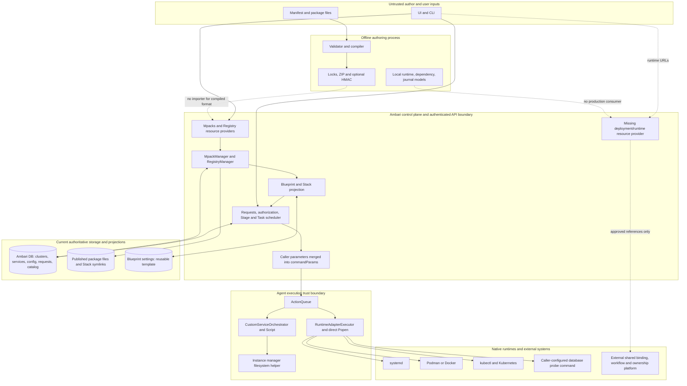

<!--
Licensed to the Apache Software Foundation (ASF) under one or more
contributor license agreements. See the NOTICE file distributed with
this work for additional information regarding copyright ownership.
The ASF licenses this file to you under the Apache License, Version 2.0
(the "License"); you may not use this file except in compliance with
the License. You may obtain a copy of the License at

    http://www.apache.org/licenses/LICENSE-2.0

Unless required by applicable law or agreed to in writing, software
distributed under the License is distributed on an "AS IS" BASIS,
WITHOUT WARRANTIES OR CONDITIONS OF ANY KIND, either express or implied.
See the License for the specific language governing permissions and
limitations under the License.
-->

# Independent Mpack V2 architecture and implementation review

Historical baseline: `c7dc663f7c68f58656be22b5ec19f9a9c4499412`.
Current repair status is in [../status.md](../status.md). All source locations
below refer to that baseline; use `git show c7dc663f7c:path` to inspect them.
They do not describe repaired code.

Review date: 2026-09-10 UTC. This report is an independent assessment, not an
implementation checkpoint or release approval. Repository documentation is
reviewed evidence; its previous decisions and completion statements are not
assumed correct. No implementation fixes, remote writes, live deployments,
credential inspection, or changes to another worktree were performed.

## 1. Architecture conclusion

**The direction is viable, but the current implementation is not a usable
general software-management platform. Do not accept the current tip for runtime
use before F01 is fixed.** The existing catalog/registration/legacy projection
integration is substantive. R1 is an offline tooling prototype plus an Agent
command-dispatch implementation and a frontend prototype. It does not establish
a controlled, authorized, recoverable deployment boundary across the four
advertised runtime families.

The target architecture can support a bounded set of host services, containers,
Kubernetes workloads, clients, and observed external resources without replacing
Ambari identity. It cannot presently demonstrate even the complete Redis host
reference, and the Kyuubi dependency flow stops before an authoritative binding
can be obtained. These are delivery gaps, not a reason to implement every future
runtime or data-migration strategy before accepting a safe legacy M2 catalog.

| Dimension | Independent assessment |
| --- | --- |
| Architectural fit | Package definition, existing ServiceRef, target binding, operation, and observation are useful distinctions. Keeping native controllers and Ambari authority is appropriate. Actual provisioning still resolves components through one Stack; generic runtime operations bypass the existing script execution boundary. |
| Responsibility clarity | Registry and compatibility advisor responsibilities are reasonably separated. Compiler has no deployment side effects. However, three capability descriptions, multiple validation paths, two runtime models, a separate unused journal, and Blueprint lifecycle fields have no coherent production consumer. |
| Maintainability | Existing helpers and frameworks are reused in M2. R1 duplicates contracts across Python, Java, and TypeScript without serialization/conformance tests. Completing more facades now would increase maintenance cost without improving the deployment path. |
| Extensibility | Software names are not hard-coded into the new runtime adapters. That is useful but insufficient: resources/configuration/health declarations are not translated into runtime work. Adding ordinary software still requires manual argv/hooks or legacy XML/Python definitions; adding a runtime changes several hard-coded registries. |
| Stability | Real defects exist in authorization, repeat execution, output handling, verification, secrets, and package publication recovery. Passing offline/model tests do not cover these paths. |
| Complexity control | No new microservice, message bus, service identity, or live binding database was added. Preserve that restraint. Collapse unused protocol replicas and complete one vertical reference before adding more abstractions. |

### Scope, baseline, and evidence boundary

- Worktree: `/jialiangc/bigdata/prjs/ambari-mpack-v2`; branch:
  `AMBARI-14714-mpack-v2-remote`; reviewed HEAD:
  `c7dc663f7c68f58656be22b5ec19f9a9c4499412`.
- Applicable instructions: repository `AGENTS.md` and the user's supplied global
  instructions. No more specific AGENTS files were found in affected subtrees.
  Historical worker/model/publication instructions in design documents were not
  treated as authorization for this review.
- M2 baseline is **`b72ade8fcfd553ff182f3d34fe63c0903616005a`**, independently
  established from the commit creating `reviews/M2-candidate.md` and
  `docs/mpack-v2/execution-log.md:153`. The candidate document itself still says “pending commit” at
  `docs/mpack-v2/reviews/M2-candidate.md:72`; there is no need to guess the baseline.
- M2 provenance: initial trunk `8051a841cf`, explicit merge `a34f92f1ac`,
  server `5c534fd6ae`, Agent/instance manager `cf346698cc`, UI `d612c51395`,
  evidence `20845fca01`, candidate record `b72ade8fcf`.
- All 21 post-M2 commits were inventoried and reviewed by topic against the final
  implementation: `63aa42dd81`, `3e68f4b2fd`, `42ac78ece2`, `dedce97407`,
  `87694e3d0d`, `c76a701858`, `87bcbdc2ab`, `ae0f2d0fce`, `9d76b1717d`,
  `7a23c18a10`, `a3bc0de762`, `db49706580`, `e575254878`, `42b389a91b`,
  `d44023c0b6`, `3bbac13d92`, `281afcf831`, `5854d98a88`, `b2c67459df`,
  `0203baf86b`, `c7dc663f7c`. Aggregate: 59 paths, 3,540 additions, 69 deletions.
  M2 versus initial trunk: 176 paths, 17,822 additions, 1,109 deletions. The review
  followed relevant M2 callers, persistence, and compatibility paths as well.
- Initial index/worktree were clean, with no relevant untracked implementation.
  All 225 changed paths since initial trunk were scanned for conflict markers and
  credential patterns. No conflict markers or confirmed embedded credentials
  were found. Pattern hits were a constant at `ExecutionCommand.java:547` and a
  URI-redaction test fixture at `model.test.ts:76`; no original values are reproduced.
  This is a bounded pattern scan, not proof that arbitrary payloads contain no secrets.
- All requested design/runbook/review documents were read, including all seven
  `W1-*.md` files. The relevant Ember admin baseline and actual Classic controller
  were inspected. The new generic runtime screen has no completed legacy parity
  counterpart. The baseline documents cover Stack/Versions behavior, not an
  implemented generic runtime API.
- The pinned multi-cluster reference `8bf556b6ce94b350b3c3b12e15a7882d07bd19f7`
  was inspected through Git objects, including its status, binding entity, and
  readiness policy. Its own status explicitly says compilation/runtime acceptance
  was pending. No other worktree was changed.
- This is a source/contract review with focused tests and isolated process probes.
  No authenticated server HTTP integration, fresh/upgrade database execution,
  live systemd/engine/Kubernetes/database integration, or browser acceptance was
  performed. Remaining uncertainty is concentrated in those boundaries and the
  unintegrated shared platform, not concealed as successful execution.

### Supported boundary and domain model

| Concept | Necessary responsibility and current implementation |
| --- | --- |
| Package / PackageVersion | Immutable software-management definition, release, and content identity. Keep separate from software binary and data-schema versions. Current Java catalog stores name/version/URI, without a verified digest; Python manifest and ZIP digests are separate and unconnected to consumption. |
| ServiceRef / Deployment | Keep `(cluster_id, service_name)` as authority. “ServiceDeployment” can initially be this existing entity plus additive package/desired-state metadata; it need not be a second service identity or repository. |
| PackageDeployment | Useful only for a real installation selecting one or more package versions for ServiceRefs. It must not become an independent lifecycle engine. A reusable Blueprint setting is not an instance record. |
| RuntimeProfile / RuntimeTarget / TargetBinding | Profile is mechanism/schema/version; target describes an authorized execution destination; binding durably associates the exact native resource and owner. Combine target/binding storage initially if that avoids two representations of the same association. None is an independent ownership root. |
| DependencyBinding | Required for shared provider/consumer relationships, but owned by the shared platform. Mpack owns typed requirements/export/probe logic, not UUID allocation, approval, readiness, or fencing authority. |
| Operation / Plan / Observation | Plan is immutable proposed work; operation is the existing request/task execution with extra references; observation is timestamped evidence. They must not be interchangeable success flags. |

ClusterServiceEntityPK still preserves cluster/service identity (`ambari-server/src/main/java/org/apache/ambari/server/orm/entities/ClusterServiceEntityPK.java:27`).
MpackReference rejects service aliases (`ambari-server/src/main/java/org/apache/ambari/server/topology/MpackReference.java:93`), and no ServiceGroup primary-key
migration was imported. These are sound decisions. The domain documents do not
generally reduce software to HBase: its HDFS/ZooKeeper checks are software-specific
examples in the external reference. In contrast, Stack remains an implementation
dependency in registration, Blueprint resolution, and topology commands (F09).

Current supported co-existence must be stated narrowly: the same service type can
use distinct existing clusters; one cluster cannot contain multiple independent
same-type services by inventing aliases. Different component hosts/native replicas
are possible within the existing service, but the new runtime code does not yet
persist host/engine/namespace/native-UID bindings or detect target collisions.
Exclusive Agent membership is a shared-platform dependency: current
`ClustersImpl.java:111` still has a host-to-set-of-clusters map. No mpack code should
emulate exclusivity or borrow a host through runtime context fields.

### Current module graph

Solid arrows below are actual code paths. Dashed arrows are missing integrations
or intended external dependencies, not executable calls.

The intended control/execution split is appropriate, but the real trust boundary
has a hole: server authorization applies to the original action while the Agent
selects a replacement action from caller parameters. Direct Popen also bypasses
the legacy orchestrator's output/timeout machinery. There is no evidence of a
necessary new distributed coordinator; the missing pieces should live inside
the existing server/Agent request path.

## 2. Findings ordered by severity

### F01 — BLOCKER — User-supplied runtime parameters replace an authorized action with arbitrary Agent execution

**Type:** implementation defect and authorization-boundary defect. **Introduced:**
R1 Agent dispatch (`281afcf831`).

**Evidence:** `ambari-server/src/main/java/org/apache/ambari/server/controller/internal/RequestResourceProvider.java:237` authorizes service checks with SERVICE_RUN_SERVICE_CHECK;
`ambari-server/src/main/java/org/apache/ambari/server/controller/internal/RequestResourceProvider.java:507` copies arbitrary `parameters/*`; `ambari-server/src/main/java/org/apache/ambari/server/utils/StageUtils.java:266` preserves them;
`ambari-server/src/main/java/org/apache/ambari/server/actionmanager/ActionScheduler.java:1151` merges stage parameters into command parameters. `ambari-agent/src/main/python/ambari_agent/ActionQueue.py:655` dispatches
them before the legacy script path. `ambari-agent/src/main/python/ambari_agent/RuntimeAdapter.py:176` accepts arbitrary argv overrides;
`ambari-agent/src/main/python/ambari_agent/RuntimeAdapter.py:275` explicitly lets context identity override the command; `ambari-agent/src/main/python/ambari_agent/RuntimeAdapter.py:317` executes
with the Agent process environment/identity. Contract: `docs/mpack-v2/contracts.md:61` and
`docs/mpack-v2/contracts.md:144` require existing authority and server-owned API decisions.

**Trigger/current behavior:** an authenticated principal allowed to run an existing
service check can add runtime parameters to that request. The server validates the
service check, then the Agent executes the supplied runtime command instead. There
is no catalog-admin permission, package-backed operation selection, target binding,
or equality check tying inner cluster/service/profile to the authorized command.
This permits arbitrary code under the Agent execution account and potentially
management of unrelated local units or resources accessible to its credentials.
It does not require an unauthenticated caller or an imported malicious package.

**Proof/impact:** static tracing establishes the server-to-Agent path; an isolated
process probe confirmed execution and that cluster 2 context is accepted inside a
cluster 1 command. No live exploit was attempted. This defeats the existing RBAC
meaning and makes runtime expansion unsafe.

**Minimum fix:** reserve/reject all runtime control fields on generic user input;
disable this dispatch until a server producer derives the operation from a trusted
installed package and authorizes the actual action/ServiceRef/target. Agent must
reject identity/profile mismatches, not authorize business operations itself.
Typed runtime adapters construct argv; a legacy executable hook is an explicit
trusted-package capability, not arbitrary request JSON.

**Tests/prerequisites:** RequestResourceProvider → scheduler → ActionQueue payload
tests with a service-check-only principal must reject injected runtime fields;
authorized typed dispatch must preserve outer identity and native binding. No
external platform is required to close this hole. A new auth service or sandbox
is unnecessary.

### F02 — HIGH — Runtime processes can deadlock on output and escape task timeout/cancellation semantics

**Type:** implementation defect. **Evidence:** `ambari-agent/src/main/python/ambari_agent/RuntimeAdapter.py:309`, especially 317–331;
`ambari-agent/src/main/python/ambari_agent/ActionQueue.py:658`. Both pipes are read only after `poll()` reports exit; no operation deadline
is enforced. Cancellation terminates only the direct child, and observe uses no
cancel event (`ambari-agent/src/main/python/ambari_agent/RuntimeAdapter.py:168`).

**Trigger/current behavior:** a command writes more than pipe capacity, hangs, or
spawns a child. The writer blocks while the parent waits for exit; server task
timeout does not itself stop this process. Terminating kubectl or a parent command
does not establish that native mutation or descendants have stopped.

**Proof/impact:** a local Python command producing 128 KiB stdout deadlocked; the
review harness stopped its own isolated process group after two seconds. This can
exhaust Agent workers, delay unrelated services, and leave UNKNOWN side effects.

**Minimum fix:** reuse a bounded Agent process runner with concurrent output
draining, a deadline, bounded stored output, process-group cleanup where applicable,
and native outcome reconciliation. Thread the cancellation/deadline through probes.
Return UNKNOWN if native effects cannot be determined.

**Tests/prerequisites:** stdout and stderr saturation, hanging process, child
process, cancel-before-dispatch, cancel-during-verify, and late native completion.
Local processes suffice for runner tests; native cancellation needs each runtime's
later acceptance fixture. No extra recovery daemon is needed.

### F03 — HIGH — The executing path does not implement the advertised idempotency and recovery protocol

**Type:** implementation defect and integration gap. **Evidence:** `ambari-agent/src/main/python/ambari_agent/RuntimeAdapter.py:280`,
`ambari-agent/src/main/python/ambari_agent/RuntimeAdapter.py:293`, `ambari-agent/src/main/python/ambari_agent/RuntimeAdapter.py:315`; `ambari-agent/src/main/python/ambari_agent/ActionQueue.py:695` and `ambari-agent/src/main/python/ambari_agent/ActionQueue.py:706`; `mpack-authoring/src/main/python/mpack_authoring/journal.py:25`; `mpack-authoring/src/main/python/mpack_authoring/recovery.py:20`;
`docs/mpack-v2/reviews/R1-status.md:19`. The key is passed as an environment variable; the executor never
consults OperationJournal. That journal is a whole-file mutable map, not the
append-only history its docstring claims; it has neither locking nor fsync/CAS.

**Trigger/current behavior:** repeat submission, Agent reconstruction after a lost
response, apply success followed by failed observation, or cancellation. The action
runs again. UNKNOWN is represented in a nested payload, but ActionQueue reduces
nonzero exit to FAILED and can retry it using the ordinary retry flag, without
checking safe replay or native evidence. A local OperationRecord permits state
transitions but governs no executing task.

**Proof/impact:** submitting one temporary-file mutation twice with the same
operation/idempotency key, including a fresh executor instance, produced two
mutations. Non-idempotent initialization or migration can corrupt state. Existing
Ambari request/task persistence does exist; it simply lacks the added exact plan,
native binding, and recovery semantics. It is inaccurate to call this absence of
all server persistence.

**Minimum fix:** make one server operation extension reference the existing
request/tasks and immutable intent. Add only the Agent checkpoint/lock needed for
host-side in-flight evidence; runtime-native revisions/idempotency remain native.
Treat UNKNOWN as a reconciliation gate, suppress automatic unsafe replay, and
map cancellation/result states consistently. Remove the unused journal from the
claimed production path rather than installing another operation database.

**Tests/prerequisites:** duplicate key/same intent, duplicate key/different intent,
restart between effect and response, verify failure after success, UNKNOWN with
retry enabled, cancellation and late responses. Local subprocesses/temporary
storage can prove these; shared owned-workflow support is a later integration
dependency, not a prerequisite for failing closed today.

### F04 — HIGH — Verification proves command exit, not the requested postcondition; recovery changes intent

**Type:** implementation defect. **Evidence:** `ambari-agent/src/main/python/ambari_agent/RuntimeAdapter.py:133`, `ambari-agent/src/main/python/ambari_agent/RuntimeAdapter.py:163`, `ambari-agent/src/main/python/ambari_agent/RuntimeAdapter.py:198`,
`ambari-agent/src/main/python/ambari_agent/RuntimeAdapter.py:215`, `ambari-agent/src/main/python/ambari_agent/RuntimeAdapter.py:233`, `ambari-agent/src/main/python/ambari_agent/RuntimeAdapter.py:297`. All ordinary successful observations become HEALTHY.
Systemd stop verifies with `is-active`; OCI uses `inspect`; Kubernetes uses `get
deployment`. Recover restarts a unit/container or scales a deployment to one/default
replicas, without reading the previous operation's desired outcome.

**Trigger/current behavior:** stopped Redis is reported as a failed stop; a stopped
container or deployment with zero ready replicas is considered healthy when a
metadata lookup returns zero. Recovery of a stop/install/configure operation can
instead restart the service. No application health or applied-config generation
is verified.

**Proof/impact:** local stop/observe commands reproduced FAILED after successful
stop. Injected native-output fixtures reproduced HEALTHY for a stopped container
and unready deployment. These are parser/semantic proofs, not runtime integration.
False readiness can start dependent software prematurely; recovery can violate
operator intent.

**Minimum fix:** define postconditions per capability: stopped, installed,
configured, running, ready, and healthy separately. Parse native structured state,
generation, and identity. Recover the saved operation by observation; use restart
only as an explicitly supported action.

**Tests/prerequisites:** inactive unit is successful stop; stopped container cannot
prove start; K8s observedGeneration/readiness/replica checks; wrong UID; unknown
probe; recovery preserves stop intent. Native fixtures can establish parsing;
isolated runtime acceptance is needed before declaring support.

### F05 — HIGH — Plans and discovery have no enforceable target/capability/revision evidence

**Type:** architecture and implementation defect. **Evidence:** `ambari-agent/src/main/python/ambari_agent/RuntimeAdapter.py:46`,
`ambari-agent/src/main/python/ambari_agent/RuntimeAdapter.py:94`, `ambari-agent/src/main/python/ambari_agent/RuntimeAdapter.py:100`, `ambari-agent/src/main/python/ambari_agent/RuntimeAdapter.py:190`; `mpack-authoring/src/main/python/mpack_authoring/runtime.py:25`; `mpack-authoring/src/main/python/mpack_authoring/operation.py:29`; `ambari-server/src/main/java/org/apache/ambari/server/agent/RuntimeAdapterCommand.java:35`.
The production adapter uses a static capability set; the four-way capability
intersection is local-only. Discovery echoes parameters and a caller revision;
it does not discover binaries, runtime versions, credentials, resource facts,
scope, observation time, or expiry. `runtime_plan` is defined but unused.

**Trigger/current behavior:** request install with no implementation, change desired
configuration from generation 1 to 2, omit both revisions, or reuse the same native
name for a replacement object. Install is advertised and planned, then fails only
at apply. Desired != observed is rejected for legitimate configuration changes;
omitting revisions permits mutation. No plan hash, current expected revision,
native UID/resourceVersion, host/engine/API-server binding, ownership or target
conflict check participates in apply. CLI flags/executable names are also not
bounded sufficiently by the unit/container/engine checks.

**Proof/impact:** probes confirmed unconditional install advertisement and rejection
of a valid desired-generation change. Name reuse, namespace ambiguity and stale
inputs can select the wrong resource. This prevents safe declarative onboarding.

**Minimum fix:** add a small versioned target-binding record attached to the existing
ServiceRef; include exact host/engine endpoint/API-server namespace/native UID as
applicable. Discovery returns scoped facts with freshness. Plan stores expected
current revisions separately from desired generation; apply revalidates material
preconditions. Advertise only implemented capabilities. Do not require identical
fencing machinery for all runtimes.

**Tests/prerequisites:** missing runtime binary, unsupported install, expired facts,
changed config/binding, same name/new UID, two clusters and two namespaces, occupied
port/unit, and omitted precondition fields. Native facts/ownership resolution must
come from the authorized server/native APIs; arbitrary input cannot supply proof.

### F06 — HIGH — Secrets are not contained at authoring and execution output boundaries

**Type:** implementation defect. **Evidence:** `mpack-authoring/src/main/python/mpack_authoring/compiler.py:269`, `mpack-authoring/src/main/python/mpack_authoring/compiler.py:302`,
`mpack-authoring/src/main/python/mpack_authoring/compiler.py:317`; `mpack-authoring/src/main/python/mpack_authoring/validate_manifest.py:63`; `ambari-agent/src/main/python/ambari_agent/RuntimeAdapter.py:147`, `ambari-agent/src/main/python/ambari_agent/RuntimeAdapter.py:335`, `ambari-agent/src/main/python/ambari_agent/RuntimeAdapter.py:343`; `ambari-server/src/main/java/org/apache/ambari/server/mpack/MpackConfigurationResolver.java:108`.
The exporter walks all package-root files instead of a declared inventory and
does not exclude the signing-key path. Runtime redaction is only one dictionary
level; nested parameters/argv and stdout/stderr are serialized into task output.
The unused Java resolver accepts sensitive plaintext and exposes `getValue()`;
it is not an enforcement boundary.

**Trigger/current behavior:** the signing key or a local credential file is beneath
the manifest directory, or runtime parameters contain nested credentials/native
inspect output. The key is archived; nested sensitive values remain in discovery
and ordinary task output, even though a redacted accessor exists elsewhere.

**Proof/impact:** a temporary random signing-key file appeared at a payload path in
the resulting ZIP. A synthetic nested password marker survived discovery output.
No actual credential was read or printed. Compromise of a signing secret undermines
both package confidentiality and its trust mechanism.

**Minimum fix:** export an explicit validated file inventory, exclude the actual
key path regardless of its filename, and reject secrets in persistable typed
fields. Resolve credential references only at execution; project allowlisted
outputs before persisting/reporting. Recursive name-based redaction is a secondary
guard, not the primary secret contract. Reuse Ambari credential facilities.

**Tests/prerequisites:** signing key inside/outside source, hidden/unreferenced files,
nested maps/lists/argv, native inspect output, parser errors and diagnostics, and
typed sensitive values. Local synthetic values suffice. Live scoped secret
resolution depends on the eventual server producer/credential provider.

### F07 — HIGH — Offline bundles and locks do not guarantee complete, consumable, immutable inputs

**Type:** implementation defect and integration gap. **Evidence:** `mpack-authoring/src/main/python/mpack_authoring/compiler.py:91`,
`mpack-authoring/src/main/python/mpack_authoring/compiler.py:124`, `mpack-authoring/src/main/python/mpack_authoring/compiler.py:235`, `mpack-authoring/src/main/python/mpack_authoring/compiler.py:269`; `mpack-authoring/src/main/python/mpack_authoring/build.py:24`; `ambari-server/src/main/java/org/apache/ambari/server/mpack/MpackManager.java:214`, `ambari-server/src/main/java/org/apache/ambari/server/mpack/MpackManager.java:346`,
`ambari-server/src/main/java/org/apache/ambari/server/mpack/MpackManager.java:604`; `ambari-server/src/main/java/org/apache/ambari/server/orm/entities/MpackEntity.java:50`. Contract: `docs/mpack-v2/manifest-spec.md:123`.

**Trigger/current behavior:** reference a local root-level tar archive or a mutable
remote URL, rebuild a lock into the source directory, or attempt to register a
compiled ZIP. `_package_files` drops root `.tar/.tar.gz/.zip` files even when locked.
Remote references need no hash and are never included. Dependency “locks” contain
version ranges, not resolution; requirements from different services lose their
consumer scope. `build_lock` includes its own previous output. The legacy projection
is service/component JSON, whereas registration expects legacy `mpack.json`, module
archives and metainfo; it cannot consume that ZIP/projection. Optional HMAC is
generated but no consumer verifies it. Package digest is not persisted by Java.

**Proof/impact:** probes reproduced missing locked tar payload, successful export
with an unhashed remote URL, self-including second lock, and rejection of the same
legitimate requirement slot in two different services. The bundle can validate or
sign successfully while being impossible to install offline, or authorize mutable
inputs later. Manifest digest alone does not cover changed payload bytes.

**Minimum fix:** distinguish source requirements from resolved deployment locks;
preserve service+slot identity. Hash/export all referenced local inputs, exclude
outputs explicitly, and fail offline export for unresolved remote content. Either
emit a real supported legacy package or add one versioned importer; do not maintain
two lifecycle implementations. Bind the resulting verified content digest to
registration and execution. A trust policy needs verification/key identity at
consumption; HMAC alone is not a public author-signing ecosystem.

**Tests/prerequisites:** disconnected import/install, tampered payload/signature,
mutable URL, repeated lock in source root, referenced archives, duplicate slots
across services, same release/different digest, and compiler-to-importer fixture.
Initial acceptance can use local payloads only; remote acquisition and asymmetric
signing can be deferred with explicit unsupported export outcomes.

### F08 — HIGH — Catalog publication/deletion is exception-safe in places, but not crash-safe or reference-atomic

**Type:** implementation defect in current M2 scope. **Evidence:** `ambari-server/src/main/java/org/apache/ambari/server/mpack/MpackManager.java:197`,
`ambari-server/src/main/java/org/apache/ambari/server/mpack/MpackManager.java:237`, `ambari-server/src/main/java/org/apache/ambari/server/mpack/MpackManager.java:241`, `ambari-server/src/main/java/org/apache/ambari/server/mpack/MpackManager.java:152`, `ambari-server/src/main/java/org/apache/ambari/server/mpack/MpackManager.java:261`; `ambari-server/src/main/java/org/apache/ambari/server/controller/internal/MpackResourceProvider.java:378`,
`ambari-server/src/main/java/org/apache/ambari/server/controller/internal/MpackResourceProvider.java:384`, `ambari-server/src/main/java/org/apache/ambari/server/mpack/MpackManager.java:813`, `ambari-server/src/main/java/org/apache/ambari/server/mpack/MpackManager.java:819`. Tests at `ambari-server/src/test/java/org/apache/ambari/server/mpack/MpackManagerTest.java:81` and
`ambari-server/src/test/java/org/apache/ambari/server/mpack/MpackManagerTest.java:106` cover success and an injected exception, not process interruption.

**Trigger/current behavior:** server dies after final directory/Stack link publication
but before catalog persistence, or DB deletion fails after files were deleted.
An orphan publication is ignored during startup (no DB row) but blocks re-registration
because the path exists. Conversely, deletion can leave durable metadata pointing
to missing definitions. Reference checks precede destructive removal and do not
share a transaction/lock with new Blueprint/service references; registration's
monitor does not protect removal or reference creation.

**Impact:** catalog availability and recovery can be lost after a normal crash;
concurrent deployment can lose its selected definitions. This concerns management
definitions, not proof of automatic deletion of Redis database files.

**Minimum fix:** record package availability intent/status in the existing catalog
DB, publish from private staging, reconcile incomplete states at startup, and use
an explicit deletion tombstone plus common reference/mutation guard. Quarantine
before final cleanup where useful. Idempotent same-content retry should reconcile,
not simply conflict. No distributed transaction between DB and filesystem is needed.

**Tests/prerequisites:** process/fault injection at each publication and deletion
boundary, restart/retry, DB failure after quarantine, and concurrent delete versus
Blueprint/service reference creation. Temporary directories plus embedded DB are
enough; full supported-DB migration tests remain necessary before release.

### F09 — HIGH — Package-aware Blueprint references do not drive multi-package provisioning

**Type:** integration gap and model limitation. **Evidence:** `ambari-server/src/main/java/org/apache/ambari/server/controller/internal/BlueprintResourceProvider.java:641`,
`ambari-server/src/main/java/org/apache/ambari/server/controller/internal/BlueprintResourceProvider.java:665`, `ambari-server/src/main/java/org/apache/ambari/server/controller/internal/BlueprintResourceProvider.java:683`; `ambari-server/src/main/java/org/apache/ambari/server/topology/BlueprintImpl.java:665`; `ambari-server/src/main/java/org/apache/ambari/server/topology/HostGroupImpl.java:180`; `ambari-server/src/main/java/org/apache/ambari/server/controller/AmbariManagementControllerImpl.java:5764`.
Production references to `getMpackReferences()` are only its interface,
implementation, and Blueprint coverage validation. Topology commands choose
package metadata from the component's existing repository Stack.

**Trigger/current behavior:** compose package A's services with Redis/Kyuubi from
package B, absent from A's Stack. Package reference validation resolves B, but
component/service resolution still uses the one Blueprint Stack. The selected
reference does not supply its service definitions, config ownership or exact
package version to the provisioning task. A service already available in that
Stack can mask this gap. At least one package is forced to equal the Stack identity.

**Impact:** package composition is an input projection rather than a working
deployment model. Adding ordinary software to an existing cluster still depends
on Stack integration instead of manifest/profile onboarding. This is not an
argument to reintroduce ServiceGroup or generated service IDs.

**Minimum fix:** resolve service definitions and component package selection through
an additive service-to-package association, retain existing ServiceRefs/config
relationships, and make Stack an explicitly limited compatibility projection.
Until connected, reject/document unsupported multi-package composition before
claiming a deployable Blueprint.

**Tests/prerequisites:** A-only and B-only distinct services in one Blueprint;
assert each task's digest/version/resources and config ownership; legacy Blueprint
regression; conflict when two packages supply the same existing service identity;
two clusters remain isolated. This can use server fixtures without native runtimes.

### F10 — MEDIUM — The dependency prototype invents authority instead of consuming the shared protocol

**Type:** architecture defect in local contract, with external integration gap.
**Evidence:** `mpack-authoring/src/main/python/mpack_authoring/dependency.py:67`, `mpack-authoring/src/main/python/mpack_authoring/dependency.py:77`, `mpack-authoring/src/main/python/mpack_authoring/dependency.py:93`, `mpack-authoring/src/main/python/mpack_authoring/dependency.py:105`, `mpack-authoring/src/main/python/mpack_authoring/dependency.py:112`;
`docs/mpack-v2/contracts.md:90`; `docs/mpack-v2/reviews/R1-status.md:18`. Preview allocates a UUID locally; authorization is an
optional callback/boolean; apply defaults to authorized and manufactures `revision+1`
as a fence. Observe returns READY for every unfenced supplied snapshot. There is
no consumer ServiceRef, authoritative snapshot approval/version proof, per-target
readiness, or provider incarnation validation against a store.

**Trigger/current behavior:** construct an unauthorized snapshot and call apply
without the optional argument, or call observe before preparation/verification.
Both succeed at the envelope level; the probe reproduced this. No provider was
mutated and no second live binding database was found, so this is not classified
as a deployed authorization bypass comparable to F01.

**Impact:** treating this facade as the shared contract would introduce a second
UUID/approval/fencing semantics and falsely unblock Kyuubi. A versioned string
`binding/v1` is not negotiated compatibility with the pinned reference.

**Minimum fix:** retain typed requirements and immutable external references;
inject a shared-platform client that returns authoritative identity/revision/
approval/readiness. Put synthetic allocation/fences only in clearly identified
fixtures. Default unavailable platform/unsupported named-slot combinations to an
explicit unsupported result. Use separate snapshot, row revision and operation
epoch fields where the shared contract requires them.

**Tests/prerequisites:** unauthorized/no-authorizer, provider mismatch, two consumers,
named-slot compatibility, detach/recreate, provider loss, stale snapshot, late
response and consumer readiness coverage. Shared-platform implementation and
protocol agreement are required for cross-cluster acceptance; do not fabricate
success until they exist.

### F11 — MEDIUM — Multiple validators/models disagree and do not validate the declarations needed for generic software

**Type:** architecture and implementation defect. **Evidence:** `mpack-authoring/schema/manifest-v2alpha1.json:10`,
`mpack-authoring/src/main/python/mpack_authoring/manifest.py:53`, `mpack-authoring/src/main/python/mpack_authoring/manifest.py:88`, `mpack-authoring/src/main/python/mpack_authoring/compiler.py:161`, `mpack-authoring/src/main/python/mpack_authoring/validate_manifest.py:31`, `mpack-authoring/src/main/python/mpack_authoring/profiles.py:9`,
`mpack-authoring/src/main/python/mpack_authoring/adapters.py:27`, `mpack-authoring/src/main/python/mpack_authoring/runtime.py:25`, `mpack-authoring/src/main/python/mpack_authoring/conformance.py:15`.

**Trigger/current behavior:** `displayName` passes compiler but fails the published
schema; an unsupported purge passes basic validation but fails compilation.
Arbitrary malformed resources pass compiler validation. Config schema/template
references are checked only for file existence, not contents or configRef/portRef
resolution. Roles, artifacts/platform compatibility, health/provides/operations,
resource ownership, retention, constraints and change-effect values have no
complete machine contract. “Conformance” fixtures only call the basic validator.
Capabilities are copied in profiles.py, local adapter subclasses, and Agent classes;
recover is advertised only by the latter.

**Impact:** authors and AI cannot discover one reliable acceptance contract; typoed
declarations fail late or have no consumer. New lifecycle/profile changes spread
across multiple lists and incompatible model shapes. This is already measurable
maintenance cost, not a subjective style complaint.

**Minimum fix:** one published schema per version with typed profile extensions,
one semantic validation entrypoint for CLI/build/AI, and one versioned capability
descriptor consumed by planner/Agent/UI. Collapse local adapter subclasses that
only return duplicated lists. Keep pure planner/config functions, but connect and
test their serialized contract instead of mirroring them in unused classes.

**Tests/prerequisites:** every fixture runs schema plus semantic compile; unknown
fields, invalid resource shapes, references, ports/users/paths, config constraints,
capability implementation/verify completeness, and a Python↔Java↔TS payload corpus.
All are local; a new plugin runtime or dynamic code loader is unnecessary.

### F12 — MEDIUM — Blueprint lifecycle fields and a standalone config resolver are not deployment authority

**Type:** architecture defect, integration gap, and status overstatement.
**Evidence:** `ambari-server/src/main/java/org/apache/ambari/server/topology/MpackReference.java:202`, `ambari-server/src/main/java/org/apache/ambari/server/topology/MpackReference.java:300`, `ambari-server/src/main/java/org/apache/ambari/server/topology/MpackReference.java:315`; `ambari-server/src/main/java/org/apache/ambari/server/topology/MpackLifecycleManager.java:26`, `ambari-server/src/main/java/org/apache/ambari/server/topology/MpackLifecycleManager.java:59`;
`ambari-server/src/main/java/org/apache/ambari/server/topology/BlueprintImpl.java:605`; `ambari-server/src/main/java/org/apache/ambari/server/mpack/MpackConfigurationResolver.java:39`, `ambari-server/src/main/java/org/apache/ambari/server/mpack/MpackConfigurationResolver.java:131`; `docs/mpack-v2/reviews/R1-status.md:17` and `docs/mpack-v2/reviews/R1-status.md:26`.
No production caller of MpackLifecycleManager or MpackConfigurationResolver was
found in server main sources. Blueprint settings can serialize owner/state/
generation/retention supplied by the client, but describe a reusable template,
not one cluster's live resources. `purgeExpired` removes references from a list;
it neither authorizes nor deletes retained data. `beginUpgrade` changes version
while retaining the old mpack ID, producing an inconsistent package reference.

**Trigger/current behavior:** reuse a Blueprint in two clusters, claim adoption,
change config, or begin upgrade. There is no per-deployment target ownership,
applied generation, staging/publication workflow, or audited purge decision.
Configuration Field supports basic Java types/default/effect only, without
required/range/enum/nested merge semantics or schema loading. A stored lifecycle
label does not constrain adapter commands.

**Impact:** source template, desired state, execution history and resource ownership
are mixed conceptually. There is no demonstrated data-preserving uninstall or
configuration recovery. Future data migration is not itself a current blocker;
advertising these helpers as complete lifecycle support is misleading.

**Minimum fix:** keep Blueprint as input; attach additive deployment/native-binding
metadata to actual ServiceRefs in the existing DB. Use existing config history and
desired/applied generation tracking. Server controls lifecycle transitions and
purge authorization; adapters enforce explicit owned resources. Upgrade preserves
old/current and target package references until verified. Defer migration unless
a concrete adapter has an explicit irreversible/recovery contract.

**Tests/prerequisites:** one template/two clusters, round-trip references, rejected
client-owned authority fields, version+ID consistency, staged config failure,
partial target application, retain-on-detach/delete and separate purge audit.
Requires the deployment association and existing config/task integration, not a
new global identity or lifecycle service.

### F13 — MEDIUM — Runtime UI defines package-scoped execution endpoints and loses plan/context integrity

**Type:** architecture defect and integration gap, plus UI implementation defects.
**Evidence:** `ambari-web/latest/src/api/mpackRuntimeApi.ts:21`, `ambari-web/latest/src/api/mpackRuntimeApi.ts:32`; `ambari-web/latest/src/screens/ManagementPacks/Runtime.tsx:108`, `ambari-web/latest/src/screens/ManagementPacks/Runtime.tsx:125`, `ambari-web/latest/src/screens/ManagementPacks/Runtime.tsx:177`,
`ambari-web/latest/src/screens/ManagementPacks/Runtime.tsx:190`, `ambari-web/latest/src/screens/ManagementPacks/Runtime.tsx:256`; `ambari-web/latest/src/screens/ManagementPacks/runtimeModel.ts:144`; `ambari-server/src/main/java/org/apache/ambari/server/api/services/MpacksService.java:155`; `docs/mpack-v2/contracts.md:146`.
The only resource key is catalog mpackId, with catalog-admin permission. No
cluster/service/deployment/target selection exists. Corresponding runtime resource
providers/routes are absent from server main sources. Current APIs stop at catalog,
advisor and operating-system metadata.

**Trigger/current behavior:** open Runtime from a package row: the requests cannot
load the required server data. If a provider is later connected, responses are not
guarded by a route/principal generation; failed refresh leaves old data visible.
Changing desired JSON/capability does not invalidate an existing plan. The normalized
plan discards hashes/target/digest fields and apply sends the lossy model plus the
current capability, with no persistent idempotency key. Normalizers also do not
support raw top-level arrays despite the checkpoint claim.

**Impact:** a global package definition cannot identify the runtime instance of the
same software across clusters. The API direction conflicts with existing service
RBAC and invites stale/misattributed actions; today missing endpoints limit actual
exposure, so this is not a second live authorization blocker.

**Minimum fix:** keep catalog metadata package-scoped; put instance runtime actions
under existing authorized cluster/service context plus a target/deployment reference.
Define the server contract first. Apply an immutable server plan ID with revision
and idempotency identity; preserve the raw contract separately from display models.
Invalidate plans on input/context changes and reject delayed responses. Gate the
runtime page on available server capability rather than offering a guaranteed error.

**Tests/prerequisites:** component tests for two routes/late response, failed refresh,
principal change, edited desired input, plan round trip, lost submit response and
supported/unsupported capabilities; API fixtures must be produced by the actual
resource provider. No arbitrary plugin JavaScript is currently executed, and none
is needed for these improvements.

### F14 — MEDIUM — Required verification is incomplete and the normal reactor fails RAT

**Type:** validation gap and implementation/documentation defect. **Evidence:**
`ambari-server/src/test/java/org/apache/ambari/server/mpack/MpackManagerTest.java:69`, `mpack-authoring/src/test/python/test_execution.py:29`, `mpack-authoring/src/main/python/mpack_authoring/conformance.py:15`, `docs/mpack-v2/reviews/R1-status.md:20`;
`target/rat.txt` from this review reports 32 unapproved files, including shortened
headers at `mpack-authoring/src/main/python/mpack_authoring/manifest.py:1` and `docs/mpack-v2/reviews/R1-status.md:1`. No focused tests importing the production
RuntimeAdapter or the new Java config/lifecycle helpers were found in Agent/server/
authoring tests. The 25 authoring tests exercise separate classes; six Java tests
exercise metadata and limited registration, not RBAC/workflow or DB migration.

**Trigger/current behavior:** the documented reactor entry runs root RAT and fails
before Java tests. The server-only module can pass its narrower RAT/Checkstyle and
six focused tests while excluding authoring/root documents. Tests that merely
serialize snapshots/journals do not establish runtime fencing or idempotency.

**Minimum fix:** standard ASF headers for affected source/docs; record exact module,
flags and test scope. Add the focused behavioral regressions identified above and
one producer/consumer integration fixture. Retain explicit pending fresh-schema,
upgrade, legacy install, live runtime and cross-cluster acceptance rows. Do not
require every future runtime before a safe host milestone.

**Tests/prerequisites:** root RAT, focused full current-source build, registration
crash tests, RequestResourceProvider authorization/payload path, ActionQueue runtime
tests and supported database migration fixtures. Runtime infrastructure is an
explicit prerequisite only for runtime acceptance. Missing system pip in this
environment is a separate build-environment limitation, not an attributed regression.

### F15 — LOW — Baseline and active-status documents contradict one another

**Type:** documentation deviation. **Evidence:** `docs/mpack-v2/reviews/M2-candidate.md:72` versus `docs/mpack-v2/execution-log.md:153`;
`docs/mpack-v2/architecture-decisions.md:40` / `docs/mpack-v2/README.md:26` retain remote-publication ordering whereas the active
runbook/integration plan remove it. `docs/mpack-v2/reviews/R1-status.md:17`–29 overstate several unused or
partial implementations; individual findings above describe the behavioral causes.

**Trigger/impact:** a maintainer resumes from an old “complete” row or pending SHA
and chooses an invalid acceptance scope. This increases review/recovery cost; it
does not authorize publication or establish a new technical blocker.

**Minimum fix/tests/prerequisites:** pin the exact M2 and R1 tips; mark old records
historical; replace “complete” with separate implementation/integration/evidence
columns and link the real production caller/test. Validate local links and compare
the status matrix with the tests actually run. No external dependency is required.

## 3. Capability, evidence, and scenario matrices

### Runtime capability matrix

Legend: I = real implementation; P = partial; B = controlled/local boundary only;
U = explicitly unsupported; N = not implemented. “B” alone is not production
support. Because of F01, the current arbitrary-argv boundary is not adequately
controlled even though it is labelled that way in R1-status.

| Runtime | Discover | Plan | Apply | Observe | Verify | Recover | Actual limit |
| --- | --- | --- | --- | --- | --- | --- | --- |
| host.systemd/v1 | P: static list/echo | P: one abstract step | P: existing unit start/stop; install/configure require supplied commands | P: is-active | P: wrong stop semantics; no config/app health | P: restart, not reconciliation | No artifact/user/directory/port/unit provisioning, ownership or data lifecycle; no live systemd evidence |
| oci.container/v1 | P: static list | P | P: existing container start/stop; no pull/create/configure | P: inspect exit code | P: does not parse running/health/native ID | P: restart | Engine name is arbitrary input; no image digest/persistent-volume policy, no live engine evidence |
| kubernetes.workload/v1 | P: static list | P | P: scale named Deployment only; no apply/create/Helm/CRD | P: get exit code | P: no rollout/generation/readiness/UID check | P: scale default replicas | No API-server target binding or namespace ownership; not generic workload support; no live Kubernetes evidence |
| external.database/v1 | P: static observe declaration | P: observe only | U for managed mutation | B/P: injected argv probe; no native connection/secret handling | P: command return code | U | JDBC/SQL driver, TLS, credential scope, inventory/metrics are N; no live database evidence |

No new adapter implements upgrade, delete, purge, backup, restore, migration,
or reload as a declared supported capability. These are explicit current limits,
not implicit successes obtained by providing a command with a matching name.
Health, metrics, logs and alerts are frontend record shapes; production telemetry
providers and permission-scoped queries are not supplied by this R1 implementation.

### Implementation and verification matrix

| Capability | Implementation status | Integration scope | Strongest evidence assessed | Executed in this review |
| --- | --- | --- | --- | --- |
| Legacy catalog registration/archive containment | Partial: meaningful implementation; crash/reference gaps | Existing Ambari server APIs/DB/FS | Unit tests with real temp filesystem, mocked DAOs | Six Java tests pass with explicit exec skip; no real DB |
| Registry CRUD/advisor | Implemented code; acceptance incomplete | Existing server resource provider and catalog | Static code and existing metadata tests | Static tracing; no new authenticated HTTP/registry runtime test |
| Blueprint package projection | Partial | Server Blueprint settings | Static call graph | Static; no multi-package provisioning fixture |
| Instance-manager filesystem helpers | Implemented bounded helper | Agent/common legacy Script path | 23 local filesystem/CLI tests | 23 pass; no package installation or Agent service process |
| Manifest/schema/canonical source | Partial | Local tooling | 25 offline/unit tests and counterexamples | 25 pass; schema/compiler discrepancies reproduced |
| Artifact/dependency lock, ZIP/HMAC | Partial | Local tooling | Deterministic fixture plus counterexamples | Missing payload/unresolved refs/key inclusion reproduced; no signature consumer |
| Runtime execution dispatcher | Partial and unsafe | Actual ActionQueue consumer; typed server producer missing | Static server chain and local process probes | Direct executor probes; no full server-Agent session |
| Capability discovery/plan validation | Partial | Separate local model plus static Agent declarations | Unit tests of local intersection, negative probes | Existing local tests pass; actual discovery not demonstrated |
| Durable operation and recovery | Partial | Existing generic request/task substrate; no complete runtime integration | Local journal/state tests and duplicate-execution counterexample | Repeat execution reproduced; no server restart acceptance |
| Typed config/provenance/secret references | Partial | Local Python + unused server Java helper | Unit test of local value object | Local test pass; no staged publish or credential resolution |
| Dependency binding | Partial local model; real integration not implemented | Requires external shared platform | Local envelope tests and pinned source inspection | Unsafe default/READY counterexample; no provider execution |
| Adoption/retention/deletion/upgrade | Partial template representation; runtime enforcement not implemented | Blueprint serialization helper | Static source | Static only; no data deletion performed |
| Runtime UI/observability | Partial | Local client/model; server endpoints absent | Model unit tests | 8 package/runtime model tests pass; no browser/API integration |
| AI authoring/repair | Shared basic CLI validation exists; complete loop not implemented | Local tooling | Static CLI plus compiler tests | No Redis/Kyuubi/AI repair fixture executed |
| DB migrations, packages, live support | Source exists for catalog DDL/upgrade and instance package | Server/package/runtime boundaries | Historical claims only for packaging | Fresh/upgrade DB, RPM/DEB, live runtime not executed |

### Unique authority and consistency model

| State | Current storage/owner/writer and readers | Current concurrency or gap | Minimum intended authority |
| --- | --- | --- | --- |
| Cluster/service identity and RBAC | Existing Ambari DB/ClusterServiceEntity; server controller writes; API/scheduler read | Existing keys/authorization retained; runtime context can contradict them | Existing platform only; context must be derived, never self-asserted |
| Agent host membership | Existing host mapping/ClustersImpl; server owns assignment | Exclusive membership contract is not integrated from reference | Shared host platform; no second mpack map |
| Registered package availability | mpacks/stack rows plus published directories; MpackManager writes; startup/catalog read | JVM registration monitor; no durable publication state/digest; removal separate | Catalog DB owns availability/digest; files immutable content; maps/symlinks rebuildable projections |
| Registry definitions/catalog | RegistryEntity persists source; RegistryManager writes; loaded catalog/maps read | Synchronized writes; bounded remote reads, but serialized network work and no durable snapshot lock | Definition/source in DB; resolved catalog cache is advisory |
| Blueprint package references | blueprint_settings JSON; provider writes; blueprint validation reads | Template, no runtime revision/CAS | Template input only; never per-deployment ownership or live operation state |
| Desired deployment and native binding | No dedicated durable runtime association; context carries fields | No native UID/incarnation/owner conflict check | Additive DB metadata attached to existing ServiceRefs; native controller owns actual resources |
| Configuration | Existing Ambari config/history authoritative; new resolver returns a map | New generation/provenance not connected to applied state | Existing config history + desired/applied generation per target/operation; no second config database |
| Dependency identity/approval/snapshot/fence | Required shared store is absent here; local BindingSnapshot is caller data | Local UUID/revision+1/READY are not authority | External shared binding platform; Mpack stores only versioned references and necessary projection |
| Operation intent/progress | Generic request/stage/task DB; ActionQueue statuses; detached authoring JSON journal | Runtime key unused; conflicting native tasks not serialized by binding; UNKNOWN becomes retryable failure | Existing request/task owner plus additive immutable intent and runtime checkpoint; native-specific fence only where necessary |
| Actual runtime/health | Native systemd/engine/K8s/provider; ephemeral stdout observations | No freshness/applied generation; false health possible | Native facts with scope/time/generation; persisted observation is a projection, not desired state |
| Retention/resource ownership | Lifecycle labels in template; no executed data policy | No runtime writer/guard/audit | Live binding's owned-resource/deletion policy and audited operation; default retain |
| Logs/diagnostics | Task output and transient UI models | Unbounded subprocess output, inadequate structured redaction | Bounded execution evidence linked to task; allowlisted payloads; existing log retention |

Failure ownership should be explicit: server reconstructs accepted intent/tasks;
Agent records whether an exact step was dispatched and whether its local process
has stopped; adapter queries native identity and postconditions; provider/shared
platform owns dependency approval/readiness and resource lifecycle. UI only reports
these facts. Existing Agent recovery, authoring OperationRecord, and adapter
`recover=restart` currently do not constitute one recovery model.

Safe retry categories must also differ. Immutable artifact verification, bounded
read probes, and staging a content-addressed file can be repeated. Start/stop or
declarative native updates require exact binding/revision checks and verification.
Initialization, adoption, data migration and purge require explicit operation
evidence and may need manual intervention after UNKNOWN. None should be retried
merely because the coordinator timed out or a resource with the same name exists.

Performance limits already worth addressing: blocking undrained pipes (F02), whole
journal read/rewrite with shared `.tmp` and no retention (F03), ZIP assembled fully
in memory and unbounded package walk (F06/F07), registration/registry synchronization
held across network work, separate 2-GiB extraction allowance per nested module,
and full Blueprint scans on delete (F08). A global message bus or distributed lock
service would not solve these concrete local issues.

### Redis end-to-end walkthrough

No Redis v2alpha1 manifest/schema/runtime fixture was found in `mpack-authoring`,
the requested Mpack docs, or the Agent runtime implementation. A filename inventory
of server resources also found no Redis/Kyuubi service subtree. The nearest real
reference is the minimal/HTTP fixture. The rows below trace real entries and stop
at gaps; they are not hypothetical successful calls.

| Step | Actual entry and persistent evidence | Result / breakpoint |
| --- | --- | --- |
| Author manifest/schema/profile | `mpack-authoring/src/main/python/mpack_authoring/manifest.py:88`, `mpack-authoring/src/main/python/mpack_authoring/compiler.py:249`, `mpack-authoring/src/main/python/mpack_authoring/profiles.py:9`; canonical manifest and optional local ZIP | Simple JSON/YAML can describe a Redis-named service. No Redis schema/template/fixture verifies completeness. User/dir/port/unit fields would be untyped resources (F11). |
| Offline build/register | `mpack-authoring/src/main/python/mpack_authoring/validate_manifest.py:22` → `mpack-authoring/src/main/python/mpack_authoring/compiler.py:317`; locks/ZIP; server `ambari-server/src/main/java/org/apache/ambari/server/mpack/MpackManager.java:214` expects legacy metadata | Local build exists, but closure and importer break at F07. No executable Redis package reaches registration through this format. |
| Install on host.systemd | `ambari-agent/src/main/python/ambari_agent/RuntimeAdapter.py:190` → `ambari-agent/src/main/python/ambari_agent/RuntimeAdapter.py:194`; legacy alternative `ambari-common/src/main/python/resource_management/libraries/script/script.py:407` → `ambari-common/src/main/python/resource_management/libraries/functions/mpack_manager_helper.py:42` | No Redis artifact acquisition, user/dir/data ownership, port conflict, template, or unit installation in the runtime adapter. Existing unit start/stop only; arbitrary install argv is not declarative support. |
| Configure/stage/publish/reload | `ambari-server/src/main/java/org/apache/ambari/server/mpack/MpackConfigurationResolver.java:131`, `mpack-authoring/src/main/python/mpack_authoring/compiler.py:179`; existing Ambari config storage elsewhere | No consumer loads Redis schema or renders/stages multi-file config, publishes a generation, or selects reload/restart. Reload is unsupported. Desired != observed check is wrong (F05). |
| Health/metrics/logs/permissions | `ambari-agent/src/main/python/ambari_agent/RuntimeAdapter.py:163`/198, `ambari-web/latest/src/api/mpackRuntimeApi.ts:51`, `ambari-web/latest/src/screens/ManagementPacks/Runtime.tsx:263` | is-active only; no Redis ping/readiness, metrics/log provider, cluster-scoped runtime endpoint or permission integration. |
| Duplicate submit/Agent restart/lost response | `ambari-agent/src/main/python/ambari_agent/RuntimeAdapter.py:280`/293, `ambari-agent/src/main/python/ambari_agent/ActionQueue.py:706`; generic request/task status | Repeated key reexecutes; no exact native binding/journal read. Temporary-process counterexample proves the gap, not a Redis runtime test. |
| Upgrade | `ambari-server/src/main/java/org/apache/ambari/server/topology/MpackReference.java:315`; legacy upgrade Script `ambari-common/src/main/python/resource_management/libraries/script/script.py:1147` | New runtime advertises no upgrade; template version mutation is not verified binary/config/data upgrade. Old/new package history and compatibility evidence absent. |
| Detach/delete/retain/purge | `ambari-server/src/main/java/org/apache/ambari/server/topology/MpackLifecycleManager.java:35`/59; catalog remove `ambari-server/src/main/java/org/apache/ambari/server/controller/internal/MpackResourceProvider.java:358` | Only helper state/list changes and catalog unregistration. No owned Redis resource record, retention enforcement, deployment detach/delete endpoint or separate data-purge authorization/audit. No data was deleted in review. |

Minimum Redis acceptance needs one actual local archive or supported distribution,
typed schema/templates, host target binding, generic resource primitives, a real
server operation producer, Agent checkpoints, Redis health verification, and
failure fixtures for partial install/config/restart. Data migration/purge can stay
unsupported initially; retained data and non-destructive uninstall must be proven.

### Kyuubi end-to-end walkthrough

| Step | Actual entry and persistent evidence | Result / breakpoint |
| --- | --- | --- |
| Host/Kubernetes authoring | `mpack-authoring/src/main/python/mpack_authoring/manifest.py:88`, `mpack-authoring/src/main/python/mpack_authoring/compiler.py:191`; `ambari-agent/src/main/python/ambari_agent/RuntimeAdapter.py:190`/225 | No Kyuubi package or compatibility fixture. Host adapter only operates an existing unit; K8s adapter scales an existing Deployment. Neither creates Kyuubi or discovers a usable Spark runtime. |
| Spark/Hadoop/Hive requirements | `mpack-authoring/src/main/python/mpack_authoring/compiler.py:124` → `mpack-authoring/src/main/python/mpack_authoring/dependency.py:16` | Only interface/version-range descriptors. No artifact/client version resolution, target coverage, Spark submission contract, Hadoop/Hive client profile or named-slot platform mapping. |
| Cross-cluster authorization/binding | `mpack-authoring/src/main/python/mpack_authoring/dependency.py:67`/93; `docs/mpack-v2/contracts.md:90`; pinned reference binding entity | Stops before a shared authoritative binding exists. Local UUID/boolean/fence envelopes cannot substitute for consumer/provider authorization and immutable approval. No binding tables/provider endpoints are integrated here. |
| Config/secret propagation | `mpack-authoring/src/main/python/mpack_authoring/dependency.py:23` values dict; `ambari-server/src/main/java/org/apache/ambari/server/mpack/MpackConfigurationResolver.java:131` | No export allowlist, client-only configuration projection, credential delivery, generation agreement or multi-file Kyuubi defaults/env/Hadoop/Hive template fixture. |
| discover/plan/apply/verify/recover | `ambari-agent/src/main/python/ambari_agent/RuntimeAdapter.py:94`/100/293 | Static declarations and command execution; no provider readiness gate, exact target evidence, Kyuubi probe or saved-operation reconciliation. No verified host or K8s deployment. |
| Provider unavailable/stale binding | `mpack-authoring/src/main/python/mpack_authoring/dependency.py:105`; `ambari-agent/src/main/python/ambari_agent/RuntimeAdapter.py:297` | Unfenced input is labelled READY; Agent receives no authoritative binding revision/readiness precondition. No safe propagation/invalidation/start guard. |
| UNKNOWN/retry/late response | `ambari-agent/src/main/python/ambari_agent/ActionQueue.py:695`/706, `mpack-authoring/src/main/python/mpack_authoring/recovery.py:20` | Local state class does not control requests; no consumer incarnation/approved snapshot/task-result matching. Provider may complete while consumer sees failure; generic retry is not safe evidence. |
| Upgrade/config compatibility/data migration | `ambari-server/src/main/java/org/apache/ambari/server/topology/MpackReference.java:315`; `docs/mpack-v2/reviews/R1-status.md:27` | No Kyuubi/Spark/Hadoop/Hive compatibility matrix, staged client/config upgrade, engine draining semantics, binary/data history or migration fixture. Unsupported must remain explicit. |

Shared-platform prerequisite: agreed binding UUID/incarnation, immutable endpoints,
row revision, approved snapshot, operation epoch, authorized client configuration
export and per-consumer-target verification. Software adapters supply Kyuubi's
actual client/probe knowledge. Provider-owned Spark/Hadoop/Hive resources must
remain independent of consumer detach. The pinned HBase/HDFS/ZooKeeper reference
provides useful protocol ideas but cannot be reused as a generic readiness result
or considered completed secure runtime integration.

### Checks actually executed

Commands ran from the reviewed root unless a working directory is shown. Test
presence and historical reports are not counted as execution evidence.

| Command | Result and limit |
| --- | --- |
| `PYTHONDONTWRITEBYTECODE=1 PYTHONPATH=mpack-authoring/src/main/python python3 -m unittest discover -s mpack-authoring/src/test/python -v` | PASS: 25 tests; offline/local classes only |
| `PYTHONDONTWRITEBYTECODE=1 PYTHONPATH=mpack-instance-manager/src/main/python/instance_manager python3 -m unittest discover -s mpack-instance-manager/src/test/python/instance_manager -p 'test*.py' -v` | PASS: 23 filesystem/CLI tests |
| `npm test -- src/screens/ManagementPacks/runtimeModel.test.ts src/screens/ManagementPacks/model.test.ts` in `ambari-web/latest` | PASS: 2 files, 8 tests; no browser or server |
| `mvn -o -pl ambari-server -am -DskipPythonTests -Dtest=MpackManagerTest,MpackTest -Dsurefire.failIfNoSpecifiedTests=false test` | FAIL at root RAT: 32 unapproved files; Java tests not reached |
| Same reactor command with `-Drat.skip=true` | Supplemental attempt STOPPED by reviewer while unrelated Admin frontend npm work ran; no Java pass claimed; no source fix or permanent check bypass |
| `mvn -o -f ambari-server/pom.xml -DskipPythonTests -Dtest=MpackManagerTest,MpackTest test` | FAIL before tests: `/usr/bin/python3` has no pip for bundling |
| `mvn -o -f ambari-server/pom.xml -Dexec.skip=true -DskipPythonTests -Dtest=MpackManagerTest,MpackTest test` | PASS: 6 tests; Server module RAT and Checkstyle pass; Python bundling/executions skipped, root RAT not run. Maven incremental compiler reported classes up to date; this was not a clean rebuild. |
| `PYTHONDONTWRITEBYTECODE=1 python3 /tmp/ambari-mpack-v2-review-20260910/probes.py` | Completed: 17 bounded result rows, including real local subprocesses and explicit mocked native outputs; no live runtimes |
| Additional temporary Python probes | Three counterexamples: self-including lock, invalid resources accepted, nested sensitive output retained |
| `git diff --check b72ade8fcf..HEAD`, `git diff --check`, `git ls-files -u`, scoped changed-file marker/credential scan | PASS for whitespace/unmerged/conflicts; no confirmed real credentials found |

All Maven commands used the existing
`/jialiangc/bigdata/prjs/.codex-runs/ambari-mpack-v2/tools/apache-maven-3.9.16/bin/mvn`.
Logs and probe source/results are in `/tmp/ambari-mpack-v2-review-20260910/`.
No clean full reactor, full React suite/build, RPM/DEB installation, database
migration, real runtime, or full Redis/Kyuubi flow was executed in this review.
The failed default builds are explicitly separated from the successful narrowed
check; no baseline run established them as pre-existing failures.

## 4. Minimum architecture adjustments

### Keep, combine, move, and defer

| Adjustment | Problem and concrete reuse | Cost / migration impact | Long-term cost and simpler alternative |
| --- | --- | --- | --- |
| Keep existing Cluster/ServiceRef/RBAC/Agent/request/config foundations | Prevents competing ownership; all services reuse it | Low conceptual cost; F01 needs immediate dispatch/input correction | Lowest maintenance. A new service-ID or Environment authority would require unjustified migration of every consumer. |
| Keep registry and legacy metadata projection as compatibility modules | Existing catalog/admin/legacy scripts are real consumers | Moderate work to add digest/publication recovery; retain legacy formats explicitly | One bounded reader per format. Do not redesign registry recommendations into runtime binding authority. |
| Combine canonical validation, capability descriptors and pure planner | Eliminates divergent lists/models; CLI, server and Agent share serialized fixtures | Moderate; alpha input corrections are possible with versioned errors and fixture migration | One contract to maintain. Thin adapter subclasses returning lists do not justify separate modules. |
| Add minimal service/package/target association in existing DB | Needed for actual native ownership, two clusters, package selection and retention | Moderate schema/API work; references current identities and supports existing deployments without PK migration | Necessary state, not a new control plane. Blueprint-only state is insufficient because templates are reused and resources outlive them. |
| Extend existing request/task intent with plan and revisions | Needed for lost response and audit across all adapters | Moderate; add fields/associated row and migration; preserve request/task IDs | One history and recovery owner. An independent operation DB or coordinator is unnecessary. |
| Move runtime command construction into typed adapters; reuse bounded Agent runner | Stops user argv authority and makes host/OCI/K8s semantics explicit | Moderate runtime changes; restrict unsafe alpha command input; retain trusted legacy hooks via their existing path | Share timeout/output/diagnostics once. New software uses typed declarations; new runtime can add an adapter. |
| Replace local dependency authority with an injected shared-platform client | Reuses UUID/approval/snapshot/lifecycle ownership | Small local cleanup, external protocol agreement required | Keep requirement schema/projections only; fixtures simulate failures, not authority. No second binding database. |
| Move lifecycle state from Blueprint to live deployment binding; reuse config history | Necessary for retention and applied-generation correctness | Moderate; old default Blueprint fields remain input metadata, do not migrate them as trusted adoption | Avoid dual writers; remove unused lifecycle/config facades if no consumer remains. |
| Move runtime UI to existing service context; gate unavailable integration | Resolves package/instance ambiguity and premature URLs | Low before API release; update alpha route and typed fixtures | Generic metadata view remains. No bespoke Redis/Kyuubi React pages or arbitrary package JS. |
| Defer plugin sandbox, arbitrary code extension system, autonomous reconciler, HA coordination, jobs/operators and irreversible migrations | No current consumer demonstrates these requirements | No migration now; capabilities remain explicitly unsupported | Reuse existing trusted scripts for exceptional software. Add machinery only after real consumers and threat/failure requirements are demonstrated. |

### Standard software onboarding path

1. Select an implemented, versioned runtime profile and supported OS/runtime
   combination. Define package/release/binary identities and existing service/
   component roles without generated service aliases.
2. Add one package directory containing manifest, typed schemas, templates,
   declared payload/immutable artifact references, health/observability metadata,
   and focused lifecycle/failure fixtures. Redis adds data/port/unit/health policy;
   HTTP adds executable/unit/HTTP readiness; Kyuubi adds versioned client/dependency
   contract declarations. No core Java/Python/UI edit should be required once that
   profile supports the needed resource primitives.
3. Run the same schema/semantic compiler for human or AI inputs. Resolve artifacts,
   preserve secret references, inspect the diff, test, produce immutable content,
   and verify trust at import. AI gets no direct apply or approval shortcut.
4. Server resolves an existing ServiceRef and authorized target, discovers facts,
   obtains shared binding evidence, computes a typed plan, authorizes the actual
   operation, and persists it against request/task identity before mutation.
5. Agent validates command identity and expected binding, executes through one
   bounded runner/adapter path, records step evidence, verifies postconditions and
   reports typed result/UNKNOWN. Server owns reconciliation and policy.
6. UI/CLI observe the same plan/operation/evidence. Configuration uses existing
   history; detach/uninstall retains persistent resources; purge is a separate
   supported authorized operation, or explicitly unavailable.

Today step 2 can only produce incomplete alpha metadata; steps 3–5 do not connect.
Adding Redis, Kyuubi or HTTP now requires either completing these shared modules
or authoring a legacy service package with software-specific scripts. Adding one
configuration field should ultimately touch package schema/template/test only;
today no schema-to-runtime application path exists. Adding a capability currently
touches profiles.py, local adapters, Agent classes and UI/operation mappings.
Adding a new runtime may legitimately add a typed adapter and capability schema,
but must not fork platform authorization, task persistence or dependency ownership.

### Runtime differences to preserve

- Host: Agent membership, users/files/units, local mutation lock and verified unit/
  application conditions. Archive install/config publication need explicit owned
  paths. Reuse Ambari resource primitives rather than invent a command language.
- OCI: bind an authorized engine endpoint and immutable container identity; image
  digest, volume ownership, inspect/health and recreate semantics are specific.
  Docker/Podman compatibility is a tested subset, not an arbitrary executable name.
- Kubernetes: bind API-server identity, namespace, kind/name/UID/resourceVersion;
  use native declarative update and controller readiness. Do not force stop to mean
  scale-zero for jobs, StatefulSets, external resources or all workload types.
- External database: observation-only is a valid initial capability. Scoped
  connection/TLS/secret/probe contracts are required; install, delete, repair and
  migration remain unavailable unless a provider-specific contract supports them.

The simplified call chain is **one schema/compiler → existing catalog → existing
service/target authorization and planner → existing request/tasks → bounded Agent
adapter → native evidence → same request/observation APIs**. Native facts and
shared dependencies remain external authorities. Each added object solves a
demonstrated ownership or recovery problem; none duplicates platform control.

## 5. Repair order and acceptance conditions

| Order | Result / findings | Modules and prerequisite | Sufficient local acceptance | Deferred work |
| --- | --- | --- | --- | --- |
| 1. Identity and permission | Close F01; runtime execution cannot replace another authorized action | Request parsing, scheduler producer, ActionQueue/RuntimeAdapter; no external dependency | Service-check-only caller cannot submit runtime control fields; typed authorized payload preserves cluster/service/profile; legacy requests unchanged | Broad runtime enablement remains disabled |
| 2. Secret and content integrity | Close F06/F07 immediate export leaks and missing content | Compiler/inventory, CLI, catalog digest/import policy | Synthetic key never enters ZIP/output; every locked local input exported/verified; unresolved offline refs fail; repeat build stable; tamper rejected | Remote acquisition/signing ecosystem can wait behind explicit limitations |
| 3. Catalog/data integrity | Close F08; establish minimal live binding ownership for F05/F12 | Existing catalog DB/FS, service association, reference guard | Crash/retry at each boundary converges; concurrent reference/delete safe; template reuse cannot transfer ownership; retained resources never implicitly purged | Full data migration and automatic purge not required |
| 4. Operation reliability | Close F02–F05 | Existing request/tasks, bounded runner, native-target checks; depends on 1 and binding identity | Pipe saturation/deadline/cancel tests; duplicate submit/restart/lost response executes at most the declared safe effect; UNKNOWN blocks unsafe retry; correct stop/readiness and recovery intent | No new global recovery service or multi-layer fences |
| 5. Declarative host loop | Close F09/F11 and connect config portion of F12 | Canonical schema/compiler/importer, package association, host adapter/config workflow | Redis plus ordinary HTTP installed/configured/started/observed from package-only changes; two clusters; user/dir/port/unit conflicts; staged-config rollback; retained data on removal | Other runtime families need not block this milestone |
| 6. Shared dependency/Kyuubi | Resolve F10 with external platform | Agreed UUID/incarnation/snapshot/approval/client-profile and readiness contract; host loop available | Local server/provider fixtures prove forbidden/stale/provider-loss/detach/recreate/lost-response behavior; Kyuubi client config is scoped and repeatable | Real multi-cluster runtime acceptance requires the shared platform; no synthetic READY |
| 7. OCI/K8s/external runtime acceptance | Implement only selected resources/actions | Typed adapter contracts; 1–4 complete | Native-output fixtures plus isolated engine/K8s/DB integration prove exact IDs, readiness, partial apply, persistent resources and cancellation | Helm/operators/jobs/remote DB mutation only when requirements justify them |
| 8. UI, maintenance, evidence | Close F13–F15 | Actual service-scoped APIs and operations; standard headers/contracts | Component route/late-response/plan invalidation tests; server-produced payload fixtures; root RAT and focused tests pass; status matrix agrees with evidence | Bespoke pages, arbitrary plugin JS, AI-specific authority remain unnecessary |

Within the present milestone, the immediately necessary work is the security
blocker, known runtime/process/content defects, and truthful capability gating.
Catalog crash/reference safety belongs to M2 acceptance. A usable general host
platform additionally requires one complete Redis/HTTP path. Kyuubi cross-cluster,
all native runtimes, full migration/rollback, automatic repair and arbitrary plugin
execution must not be silently claimed, nor all promoted to current BLOCKERs.
