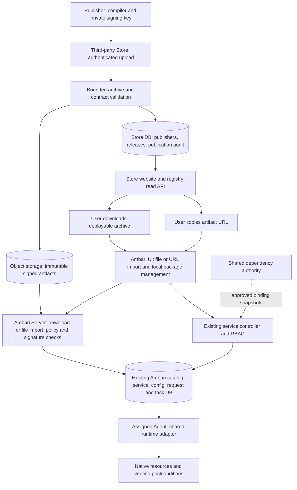

<!---
   Licensed to the Apache Software Foundation (ASF) under one or more
   contributor license agreements. See the NOTICE file distributed with
   this work for additional information regarding copyright ownership.
   The ASF licenses this file to You under the Apache License, Version 2.0
   (the "License"); you may not use this file except in compliance with
   the License. You may obtain a copy of the License at

       http://www.apache.org/licenses/LICENSE-2.0

   Unless required by applicable law or agreed to in writing, software
   distributed under the License is distributed on an "AS IS" BASIS,
   WITHOUT WARRANTIES OR CONDITIONS OF ANY KIND, either express or implied.
   See the License for the specific language governing permissions and
   limitations under the License.
--->

# Third-party Mpack Store design

## Scope and repository ownership

Status: proposed, not implemented. This is the single Store design document, separated
at the user's request from the Ambari architecture and implementation plan. It is held
here for planning and must move to the new independent Store repository when Store
implementation starts; leave a link here instead of maintaining duplicate designs.

The Store website, backend, publisher CLI, metadata migrations, object-storage access,
validation jobs, tests and deployment assets will be implemented later in that new
repository. Do not add Store implementation to Ambari modules or its build. This
request prepares the design only; no new repository has been created or deployed.
Repository owner/name, domain and hosting are to be set when that work starts. Apache
hosting or endorsement is not required. The Store has an independent release cadence.

Ambari owns its package contracts/compiler, file/URL importer and service lifecycle.
The Store consumes versioned exported contracts and the existing compiler's validation
interface rather than maintaining a fork of manifest semantics. Its implementation
must not require building the whole Ambari server. Availability of a standalone
validator distribution is an explicit integration deliverable, not an existing claim.
The [English authoring guide](../../mpack-authoring/README.md), canonical examples and
[local validation script](../../mpack-authoring/validate.py) live with the compiler in
Ambari. The future Store should consume that versioned tooling; it must not fork the
validator or treat local host-export checks as real runtime certification.

## Product flow and trust boundary

Authors upload a built deployable Mpack through a web page or publishing CLI, publish
versions, inspect validation and withdraw releases. Users browse/search, filter by
compatibility/runtime, inspect provenance and download a selected version on the
third-party website. They then upload that file or paste its artifact URL into Ambari.
Both paths use one Server importer and require no Store-specific discovery API.

The Ambari UI distinguishes import of a package definition, installation into an existing
cluster, management of an installed service, uninstall of owned runtime resources,
and removal of an unreferenced catalog definition. Native uninstall retains data by
default; detach and separately authorized purge have different semantics. Import alone
creates no native resources. Catalog deletion never substitutes for native uninstall.

Store publisher accounts authorize publication only. The Store has no cluster
credentials, Agent connection, deployment permission, binding ownership or cluster
recovery loop. Store outage does not affect running services or cached pinned
definitions. Offline import requires no Store callback. Store compatibility filtering
is advisory; Server authorization/validation and target discovery decide execution.

## Service architecture and release contract

Direct upload needs one backend, one relational metadata database and object storage,
plus a bounded validation worker in the same codebase. Database-backed jobs and indexed
search suffice initially; no message bus, search cluster or plugin execution service.
The code repository holds Store code/schemas; object storage holds uploaded packages.

Publication states are uploaded, validating, published, rejected and withdrawn.
Staging uploads have quotas, deadlines and expiry. Verify final object existence/digest
before the DB publication transaction; expose only published rows. Persist upload/job
identity for crash recovery, remove abandoned staging objects, and back up both release
metadata and artifacts. Published bytes cannot be overwritten under the same version.
Validation checks schema, inventory, signatures, compatibility, archive limits and
prerequisite closure without executing uploaded software/hooks. Listing policy covers
first-time publishers and executable legacy packs. Validation reports distinguish
static checks, fixtures and runtime acceptance, including environment and evidence source.

Proposed registry records contain publisher namespace, package name, Mpack version,
software versions per service/component, immutable digest/size, format versions,
compatible Ambari/Agent/OS/architecture ranges, profiles/actions, prerequisite inventory,
license/source links, signature/key identity, publication status and verification evidence.
These are proposed protocol fields, not claims about today's manifest schema.
Software version and Mpack packaging revision are independent; a multi-component
package need not have one scalar software version.

Address a release by registry origin plus publisher/package/Mpack version and pin it
by digest. Mirrors can preserve verified publisher identity and digest; matching
namespaces in unrelated registries do not establish trust. Withdrawal blocks new online
selection, not existing services. Offline/cached trust and revocation metadata have an
explicit freshness policy; offline operation cannot promise immediate revocation checks.
Multiple published versions do not imply in-place upgrade support or service aliases.

Public distribution requires a versioned asymmetric signature envelope covering release
identity, compatibility, prerequisite lock and full artifact inventory. Publisher private
keys stay outside Store/Ambari. Ambari administrators configure publisher trust or an
explicitly trusted Store's publisher-key attestation policy. An uploaded public key cannot
authorize itself. Record key rotation/revocation and import trust decisions. Keep alpha
HMAC as an explicit local compatibility mode, never silent verification fallback.
Signatures establish provenance/integrity, not benign software. Administrators accept
publisher trust and declared host privileges before deployment. Default public imports
use declarative profiles; existing arbitrary-script legacy packs need a visible,
administrator-controlled policy and cannot impersonate generated descriptors.

Server download policy limits destinations/redirects and credential forwarding to
configured registry/artifact endpoints, with explicit private-registry configuration.
Use bounded transfer/extraction and staging. Registry credentials are server-side secret
references, never package fields, download URLs or logs. Browser uploads and downloads
converge on the same verification and registration implementation.

Distribute a deployable export, not today's source ZIP. Preserve deterministic legacy
projection inside a versioned import envelope. Bundle binaries where redistribution
permits; otherwise declare exact runtime/OS-package prerequisites and repositories.
Advertise fully offline installation only when every prerequisite is bundled or verified
present on selected targets. Resolve package content hashes before promising reproducible
installation; version labels and mutable OS repositories alone are insufficient.

## Integration boundary with Ambari

The artifact contract is the integration point: a signed deployable package, immutable
identity/digest, compatibility/prerequisite metadata and a downloadable file or URL.
Ambari does not need Store search, publisher accounts, publication APIs or a callback
for deployment. No iframe or Store page is embedded in Ambari. Private distribution
may require separately configured download credentials; offline file import avoids
coupling cluster operation to Store authentication or availability.

The Store can publish packages for any declared runtime, but displays unsupported or
unverified compatibility accurately. It never translates a runtime capability label
into a promise that Ambari can execute it. Installation, configuration, observability,
upgrade, migration, recovery, uninstall and data purge remain Ambari responsibilities.
Their detailed design and acceptance stay in [Ambari architecture](architecture.md#package-import-and-lifecycle-extension-proposed)
and the [Ambari plan](implementation-plan.md#package-import-and-lifecycle-delivery-plan).
When this document moves, replace those relative links with version-pinned references.

## Implementation in the future Store repository

| Order | Deliverable | Acceptance |
| --- | --- | --- |
| S0: repository and contract integration | Independent project/build; consume a pinned manifest validator and signed artifact contract; Store metadata schema | Store builds/tests independently; accepts a real compiler export and rejects an unsupported contract version; no duplicated lifecycle or compiler implementation |
| S1: publisher and upload backend | Publisher namespaces/roles, key registration, bounded uploads, immutable object storage, validation jobs and audit | Reject namespace takeover, unauthorized publication, unsafe archives and release overwrite; interrupted upload/validation resumes; uploaded software is never executed |
| S2: third-party website and publishing CLI | Publisher upload/results/releases; public search, version/compatibility/evidence details and downloads | Browser/API tests cover publish, discover, download identical bytes and withdraw; rejected/staging releases never appear published |
| S3: operating controls | Quotas, staging cleanup, withdrawal/key policy, backup/restore and access logging with redaction | Recover metadata/artifacts after local process failure; preserve published content; enforce limits and demonstrate credential-free logs |
| S4: interoperability and acceptance | File download and artifact-URL handoff to Ambari; public/private distribution and offline documentation | Identical package imports through both Ambari paths; incompatible/untrusted content is rejected; Store outage does not affect installed services; distinguish local fixtures from actual runtime acceptance |

Complete the agreed implementation batch before consolidated build and tests, then
fix observed failures and rerun affected checks. Store tests run in its repository;
Ambari tests run in the Ambari repository. Cross-repository acceptance pins both
versions and records the actual environment. No live service is implied by local tests.

## Cost and deferred complexity

One service, relational metadata storage, object storage and bounded database-backed
jobs meet the initial upload/publish/search/download requirement. The operator owns
backup, availability, account/key support, quotas and listing moderation. Native package
execution and cluster recovery are not Store operating responsibilities.

Defer ranking/recommendations, reviews, billing, a dedicated search engine, message bus,
plugin execution sandbox and a remote build farm until a concrete usage requirement
justifies them. Uploading already-built signed packages keeps publisher private keys
and build execution outside the Store. Framework and hosting selection belong to the
future repository setup and must not introduce dependencies into Ambari.
